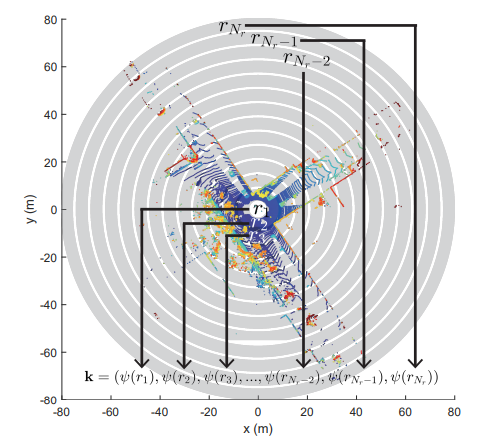
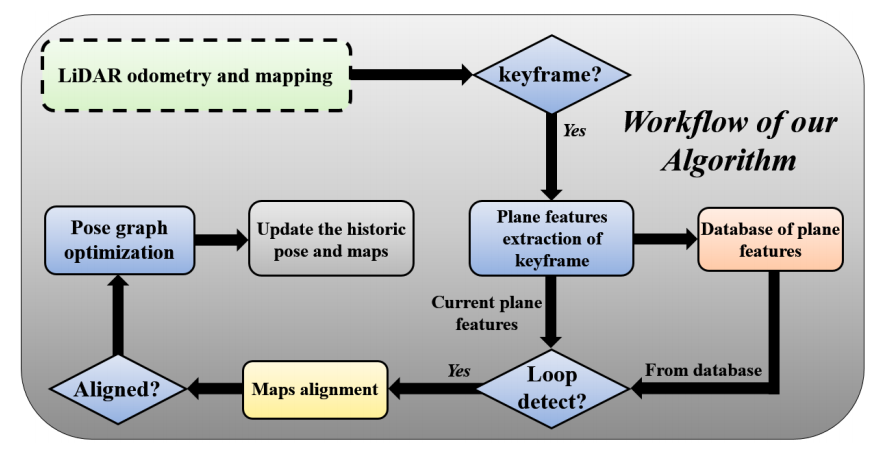

# 0. 概述

​		在机器人的运动过程中，随着运动路径的不断延伸，不管是导航还是建图，都不可避免的会出现误差累积，除了常见的局部优化、全局优化来调整位姿外，还可通过回环检测结果来进一步的消除累积误差，优化位姿。

​		回环检测，又称闭环检测，是指机器人识别曾到达的某个场景，使得运动具有闭环的能力，可以将其看做是一个分类问题，目的是确认两帧点云是否是在同一场景下采集的。在实际的应用中，回环检测是一项非常重要又比较困难的事情，主要原因在与：如果回环检测成功，可以显著地减小累积误差，帮助机器人更精准、快速的进行避障导航工作。而错误的检测结果可能使地图变得很糟糕。因此，回环检测在大面积、大场景地图构建以及导航上是非常有必要的 。

​		在计算机视觉领域，已经有非常丰富的研究以及可使用的开源框架，然而基于视觉的回环检测常常受到光照条件、季节以及视角变换等环境因素的影响而导致回环结果很差。LIDAR的测量则对这些环境信息的变化并不敏感，其返回结果描述所处场景的结构信息，对光照、季节的变换比较鲁棒，且具有较高的精度。因此，基于3D激光数据的回环检测慢慢引起了人们的关注，并提出了一些有效的回环检测方法。

​		从现有的研究结果进行分类，大致可以分为三类：①基于**非学习描述子**(hand-crafted descriptors)回环检测方法、②基于**学习的描述子**回环检测方法、③基于平面、目标物体或语义信息的回环检测方法。其中基于非学习描述子的方法按照其生成描述子的方式又可分为基于local描述子和基于global描述子两类方法。lidar点云的local描述子方法与视觉的关键点选择、匹配方法类似，即是在点云中选取关键点并使用人工设计的描述子来描述提取的点，最后通过使用关键点邻近的点进行投票计算score判断回环。相反的，global描述子方法即是使用全帧点云来生成描述子，进行描述子的相似性得分计算判断回环。

# 1. 相关工作

​		比较早期的回环检测方法是基于3D点云的局部特征来实现的。许多传统方法基于局部特征， 文献[1]提出了一种基于从 3D 点云数据中提取点特征的地点识别方法。 将获得的兴趣点应用于提取特征并对候选变换进行评分。 然后，通过设置的阈值来判断当前帧点云是否是回环候选。 PFH[2]和FPFH[3]是一种点特征直方图方法，利用了选取的关键特征点邻域点的分布关系。SHOT[4]也是通过选取关键点，将关键点周围的一定范围内的空间分成若干个区域，并收集每个区域的法线角度生成直方图来构建描述符。 文献[5]提出了一种关键点Gasalt3D描述子的投票方法。 从本地描述符的数据库中按照固定数量查询每个关键点的最近邻投票，并汇总以确定可能的位置匹配。 之后，文献[6]用强度信息丰富了SHOT方法(ISHOT)，并提出了一种新的概率关键点投票方法来实现地点识别，该方法虽然计算量很大，但是相对于纯使用几何信息的局部描述子方法来说回环检测性能更高一些。

​		鉴于local关键点描述子的描述子的方法需要一个好的关键点选取方法，且需要大量的局部几何计算。因此，便有了基于global描述子的方案。最早的global描述子回环检测方案是由[7]提出的(ESF)，该方法使用一系列直方图来描述部分点云表面上的距离、角度和面积分布，该方法已集成在PCL点云库中。文献[8]提出了一种称为M2DP的新型全局点云描述符。该方法不是在3D空间中对点云进行分析，而是将点云投影到多个不同的二维平面上。然后，通过对平面上点云的空间密度直方图进行计算，得到点云的多个空间分布特征。论文中使用这些二维签名构成的矩阵的第一个左奇异向量和右奇异向量作为最终的点云描述符。但是该方法比较依赖于点的分布，当有部分点丢失时，性能不能令人满意，且目前该方法对反向回环的检测性能不佳。文献[9]提出了一种名为Scan Context(SC)的以雷达为中心的空间描述符。SC方法使用点云的高度信息将3D LIDAR扫描中的点云编码为矩阵，之后通过暴力匹配方式查找回环候选项。之后，作者在[10]中对其进行了进一步的优化，增加了应对了平移变化的描述子，且优化了候选查找方法，使得回环计算更快，回环检测性能更好。在[9]方案的基础上，文献[11]提出了基于强度的Scan Context方法，使用强度信息代替了点云的高度信息。同时，在[9]的基础上，文献[12]对高度信息分布进行了编码以获得激光雷达-虹膜(Iris)图像，并对图像应用傅里叶变换以实现旋转不变性。文献[13]将点云表述为全连接图，图中的节点用于表示点云中的平面特征，使用平面几何约束来定义帧之间的相似性，这使得该方法在一些没有丰富平面特征的场景中将会失效。文献[14]，提出了以一种称为DELIGHT的方法，该方法首先将3D空间分成了16个部分，计算每个区域的点云强度分布直方图构成全局描述子。

​		除了上述提到的人工涉及的局部和全局特征外，还提出了一些基于高级特征(如对象或语义信息)的算法。文献[15]提出了一种基于3D点云SegMent分割进行匹配的方法。 该方法从点云中提取SegMent，将它们与历史帧的片段进行匹配，并使用几何验证步骤确定地点识别候选项。该方法也是基于高级特征进行回环检测方法中最早提出的方案。文献[16]提出了将语义信息转化为Scan Context的方法，提高了仅使用高度信息或强度信息的Scan Context方法的回环检测性能，但该方法也比较依赖于语义信息的提取精度和分类情况。

​		随着深度学习的研究和发展，3D点云的回环检测也有了一些基于深度学习的方案。与传统方案不同是，深度学习方案通常是直接从输入数据中学习特征或度量信息。按照给到深度学习模型的数据进行分类，大致可以分为四类：① 基于人工设计特征的方法；② 基于图像的方法；③ 基于3D-volume的方法以及④ 基于原始点云数据的方法。

​		**基于人工设计特征的深度学习方法。** 文献[17]将原始点云转换为半手工特征表示，并将回环检测视为相似性建模问题。 将具有旋转不变性的半手工特征表示输入到具有对比损失的连体卷积神经网络 (CNN) 中，用于闭环检测。文献[18]也采用CNN来训练SC图像实现long-term的位置识别问题。

​		**基于图像的深度学习方法。**文献[19]提出的**OverlapNet方案**是将点云转换成图像作为输入。 包括深度、法线、强度和语义信息在内的多种信息用于从单个 LiDAR 扫描生成对应的图像。 图像被输入到连体网络中，用于识别闭环候选。

​		**基于3D-volume的深度学习方法。**文献[20]等人提出了一种基于体素表示的学习方法，对体素和特征的学习以表示场景。 3D 点云数据被拆分为体素。 从这些体素中提取的多模态特征用于执行位置识别。 文献[21]提出的MinkLoc3D方法利用稀疏体素化点云表示和稀疏 3D 卷积来计算具有区别性的 3D 点云描述符。

​		**基于原始点云的深度学习方法。**文献[22]提出的**PointNetVLAD方案**是结合了文献[23]PointNet网络结构和以及文献[24]的NetVLAD方法来执行端到端训练并从 3D 点云中提取全局描述符。从 PointNet 获得的预分类结果通过度量学习方法输入到 NetVLAD，用于将 3D 点云映射到全局特征描述符。提出了“惰性三元组和四元组”损失函数，以通过增加样本之间的差异来实现更多的泛化性能。基于原始点云的方法总是需要解决排列不变性的问题。 PointNetVLAD 通过证明 NetVLAD 是一个对称函数解决了这个问题。刘等人。 文献[25]提出了 LPD-Net方案，一种大规模的地点描述网络。该网络应用自适应特征提取来获取点云分布信息和局部特征。生成的局部特征向量由 NetVLAD 处理以获得全局描述符。文献[26]提出了一种以原始点云数据为输入的地点识别算法。该算法包括两部分：使用双重注意模块的特征提取块，以及通过 NetVLAD 层将局部特征编码为全局描述符的特征融合块。 

# 2. SOTA回环检测方法详细介绍

​		此处主要详细介绍一下上述提到的几类回环检测方法中，被引用频次较高，多次被不同论文用作比较对象且属于对应分类上比较有代表性的方法的具体实现思想。方法的介绍将核心处理思想相似性进行分类。

​		此外，如上一节中介绍的，回环检测也有深度学习的方案[19]、[22]，但从论文中实验结果上看，与传统手工设计描述子方案相比，检测性能提升并不十分明显，且还需要丰富的数据集进行训练，计算比较沉重。因此，此处不对其方案做详细介绍。

## 2.1 以Scan Context为主的方案

​		这个分类一共包含[9-12]、[16]、[18]这6篇同类型的文章。基于3D点云的Scan Context方案中最具有代表性的方案是Kim实验室在2018年的IROS上提出的。之后的几篇均借鉴了该论文的处理思想，在构建全局描述子时都有类似的操作，只是在处理旋转不变性和平移不变性以及回环候选选择时有不同的方法和策略。

​		**相应方案的开源代码地址：**

1.  ScanContext && ScanContext++：https://github.com/irapkaist/scancontext，该方法以集成到多个开源的SLAM算法中做回环检测。
2. Intensity ScanContext：https://github.com/wh200720041/iscloam
3. LIDAR-Iris：https://github.com/BigMoWangying/LiDAR-Iris
4. Semantic Scan Context(SSC)：https://github.com/lilin-hitcrt/SSC

### 2.1.1 ScanContext(SC) && ScanContext++方案

​		这个方案是KAIST的NAVER实验室提出的，ScanContext是2018年发表在IROS会议上，ScanContext++是对ScanContext进行了优化改进，2021年发表于T-RO期刊。这期间，该实验室在2019年在RA-L期刊上还发表了一篇，将SC描述子转化成color图像，输入到CNN网络中，实现端到端的回环检测，用于long-term场景下的回环检测问题。

​		Scan Context(SC)是一种全局点云描述符，主要是为在室外环境获得的稀疏或含有噪声的点云而设计的。该描述子以雷达自我为中心对3D点云进行编码，提取雷达扫描数据中的3D结构信息，不依赖于直方图计算或先验训练信息。使用相似度评分score来时就按两个点云的SC之间的距离，并使用两阶段搜索算法来检测有效回环。2018年提出的方案能够应对旋转的改变，对平移变化情况下的回环检测效果不佳。2021年提出的方案则增加平移不变性的回环检测，并将第一版的暴力匹配搜索方法进行了改进，使得回环检测可在7ms左右完成。

#### **Scan Context[9]核心处理思想(IROS-2018)**

​        Scan Context方法首先需要将一个扫描帧的点云编码成一个矩阵，之后再对编码得到的矩阵执行两步搜索算法判断回环。点云编码算法如下图所示：

1. 点云俯视图中，在极坐标系下将点云划分为不同的bin，划分时依据方位角（0到2π）和半径（中心点到最大传感器范围）；
2.  将黄色区域称为ring（圆环），蓝绿色区域成为sector（扇形），黑色区域则为bin；
3.  scan context为b图的矩阵，保存了点云的绝对几何结构；每一行代表一个ring，每一列代表一个sector，矩阵每个元素的值为对应的bin中点云的最高点值；
4.  b图中，蓝色像素表示对应bin要么为空，要么由于遮挡看不到；

- **方法的贡献**

1. **高效的bin编码函数：**本文算法不需要计算每一个bin中的点的数量，而提出了一种更高效的bin编码函数，展示出对于密度及点云法线的不变性；
2.  **点云内部结构的保存：**矩阵每个元素的值都由属于该bin的点云决定。本文方法避免使用直方图，保存了点云绝对的内部结构。这提高了识别能力，能够在计算距离时将一个查询帧的视角和候选帧对齐；因此，检测反向闭环也是可能的；
3. **高效的两阶段匹配算法：**本文为了实现可行的搜索时间，提供一**种旋转不变的子描述子**，首先进行最近邻的搜索，然后分层次地把它和逐对相似性得分结合起来，也就避免了搜索整个数据库来进行闭环检测。

- **算法处理流程**

​      本文算法的处理流程如下图所示：

**A. Scan Context描述子定义**

- 使用最高点的原因：在不需要繁重计算的情况下能总结周围结构的垂直形状，以此分析点云特性；另外，最高点也说明其周围部分的区域相对于传感器是可见的；

- 首先将一个三维扫描帧在传感器坐标系中从方位角度和径向等距划分为不同的bin。$N_s$表示sector的数量，$N_r$表示ring的数量，如果激光雷达传感器的最大探测范围为$L_{max}$，则圆环间的径向距离为$L_{max}/N_r$，一个扇形的中心角为$2\pi/N_s$；论文中使用的这两个参数分别为：$N_s=60$,$N_r=20$.

- 点云分区：$P_{ij}$表示第$i$个ring和第$j$个sector重合部分bin中点的集合。

- 远离传感器的bin要比靠近传感器的bin区域面积更大，但是二者都将等同地编码为一个Scan Context的单个像素来表示；这种方式也弥补了远处点的稀疏造成的信息的不充分；

- 点云分区后，将使用每个bin中的最大高度值来表示当前bin的信息，若bin是空的，则使用0表示；最终形成 $N_r\times N_s$​​矩阵；

**B. Scan Context之间的相似性得分**

-  $I_q$和 $I_c$​分别表示查询点云和候选点云的Scan Context，通过逐列比较来获得二者的相似度；相同索引的列向量之间计算cos距离，然后所有的cos距离做个求和，除以列数来进行归一化。

  

- 由于雷达视角的变化，当机器人重回一个地点时(反向或存在一个角度)，即使是同一个位置，候选帧的scan context的列也可能发生移动，而行的顺序通常不会改变；

- 为解决上述问题，论文计算所有可能存在列移动的scan context，并找到最小距离。求得的列移动的信息可以作为定位优化，如ICP的初值；

**C. 两阶段搜索回环检测**

- 位置识别搜索的三个主流方法：逐对相似度得分、最近邻搜索、稀疏优化；论文搜索算法融合逐对得分和最近邻，来达到更合理的搜索时间；

- 论文通过ring key实现一种两阶段的层级搜索算法：ring key是一种旋转不变描述子，从scan context中提取，通过ring编码函数 $\Psi$​，将scan context的每一行r编码成一个标量值，最终形成一个$N_r$​维的向量$\mathbf{k}$​​​，向量组成如下图所示。

- 向量 $\mathbf{k}$​​作为key来构建KD-Tree，同时，查询帧的ring key被用来找相似的Key以及它们对应的帧索引。最相似的key的数量由用户指定；通过比较这些候选帧的sc与查询帧SC的距离，来找到最近的候选帧，再通过一个接受阈值，找到成为闭环的那帧点云。

#### Scan Context++[10]的核心处理思想(T-RO-2021)

​		受编码方式的影响，第一版的SC方法在移动物体存在侧向移动的情况下，回环检测的性能比较差，且在进行回环检测时使用了暴力搜搜，效率相对较低。2021年发表的论文则是为了完善第一版SC的不足，增加平移不变性，同时提升计算速度。优势总结如下：

1. **对侧向和旋转运动的鲁棒性：**城市环境中，车道变更是不可避免的，所以具有平移不变性是非常有必要的。本文则通过城市道路假设实现一定程度上的平移变换鲁棒性；
2. **半度量定位：**将位置提取和度量定位相结合，文中提出的全局定位方法弥补了拓扑定位和度量定位的，并且提出的方法不仅可以提供检索到位置的地图索引，还可以提供1D位置初值(给ICp提供yaw或lateral)；
3. **轻量化和模块特性：**不需要任何先验或者几何约束，很容易迁移；
4. **实时性：**通过引入键检索，大幅降低计算成本，计算时间能到7ms(100Hz+);
5. **丰富的实验：**在多个复杂有挑战性的数据集上进行了算法验证，除了现有的召回率和准确率指标外，提出了DR(distribution-recall)指标来评价回环的环境适应性。

- **算法概述**

​      本文的方法大致分为位置描述和位置识别两个方面。位置识别包含位置检索、半度量定位以及验证，整体流程图如下：

下面是该论文相对于第一版SC描述符论文的差异：

**A. 描述子(SCD)构成**

​		本文提出的描述符与会议版的区别在于：本文提出了对齐轴(aligning axis/A轴)以及检索轴(retrieval axis/R轴)的感念，A轴的改变代表列级别的变化，A轴的预对齐可以给出一个自由度的粗糙相对位姿。根据对A轴/R轴定义的区别，可以将SCD分为极坐标系的SCD(PC)和笛卡尔坐标系的SCD(CC)。

- 极坐标系PC：会议论文版本，方位角 $\theta$作为A轴，半径r作为R轴，该描述子在旋转下比较鲁棒；

- 笛卡尔坐标系CC：以横向y为A轴，纵向s作为R轴，该描述子在横向移动下比较鲁棒；
- 描述子分辨率：自定义坐标轴的分辨率决定了描述子分辨率，参数如下：

​                                                            $$(\Delta_R,\Delta_A,[R_{min},R_{max}],[A_{min},A_{max}])$$​​​​

​			分辨率的大小，代表了bin区域的大小，即离散化的程度。粗略的离散化能减少动态障碍物的影响，局部噪声环境和计算消耗。最终一帧点云将转化成两个描述子，如下图所示：

**C. 子描述子计算**

​		如果采用逐列对比取最低的方法来避免列平移的情况的话，时间成本很高。为了减少运行时间，引入两个子描述符，从原始的二维SCD描述符，通过求和行/列方向的描述符值提取一维向量。每一个子描述符在位置识别和半度量定位都起着主要作用。

+  **检索键:** 第一个引入的子描述符是检索键，这个向量的维度等于SCD行的数量，引入一个映射函数将每一行都映射成只有一列的实数，并且需要在每一行满足permutation invariant的条件。因为检索键满足这个条件，所以检索键必定对于旋转和平移都是鲁棒的，在实验过程中，作者应用了L1范式。在会议论文中应用的是L0范式。

+  **对齐键:** 它的维度等于列的数量，也采用L1范式映射行。

**D. 位置识别的三个步骤**

​		位置识别包含三个部分：用检索键进行位置索引->用对齐键来实现半度量定位->比较整个SCD来排除假正例。

- **检索键进行位置索引：**用检索键构建KD-Tree来快速查找最近的，论文中说k=1搜索性能最好。

- **配准建进行半度量定位：**对两位置的配准键进行暴力匹配，而不是整个SCD，见论文的等式(4)。

- **比较整个SCD来排除假正例：**做法同会议论文(子描述子可能会破坏空间的辨识度，所以需要使用整个SCD做进一步的验证)。

**E.  描述子增强**

​		因为是从 BEV (点云俯视图)中构造描述子，其运动复杂度只有三个自由度，且将3D点云转化为了 2D 描述子，说明描述子都缺少了一些自由度。例如 PC 是极坐标系下的描述子表达，缺少平移部分；CC 是笛卡尔坐标系下的描述子表达，缺少旋转部分。当车在运动中同时包括两种运动，则在进行位置识别(回环检测)时，这些缺陷将是致命的。因此，为了克服这种问题，构造了虚拟 SCDs，来增强平移不变性和旋转不变性。

- **Augmented PC(A-PC)：**为覆盖变换车道（2m 间隔的）和掉头（180°）(基于城市道路的强假设)。在强化过程中，将 PC 和虚拟的平移进行合成，由于主要目标是车道变化，在侧向各 2m 增加两个虚拟的车辆位置，因此根据虚拟车辆位置和对于点云偏移新增两个 A-PCs。

- **Augmented CC(A-CC)：**目标是为了覆盖逆转路径(相差180°)，CC的增强很简单，就是对于两个轴进行翻转。

​		在实验中，生成描述子使用的对应参数如下：

#### Scan Context总结及拓展

**方法总结：**

1. 从论文中的实验结果看，当应用与室外城市环境时，该算法优于其他算法(M2DP、SegMatch)；但室内环境下，算法的性能受限制，即该算法在室内场景这样在垂直高度上变化不明显的场景下，性能不佳；
2. 结果可以为ICP等方法提供较好的初始估计值；
3. 由于描述子是由垂直高度信息编码得到的，则在使用中要求载体满足平面运动假设，即roll-pitch都比较小，按照论文给出的实验对比来看，允许的最大roll-pitch是在5°以内；
4. 可以适用于多种测距雷达，如radar，可见论文[27]，但小FOV的雷达可能该方法的适用性不好;

**方法的拓展应用：**

​		如论文[18]，作者将3D点云生成SCD描述子转换成了Color图像，输入到CNN网络中，进行训练后用于lifeLong场景下的回环检测，将回环检测问题看做分类问题。实验中使用了NCLT和Oxford RobotCar一年里不同天气状况和不同视角下的数据进行了实验测试。基本框架如下：

​		论文[16]中，作者将进行语义分割的3D点云转换成了Scan Context进行回环检测。算法的整个框架如下，包含了两个部分：两阶段的全局语义ICP和语义描述上下文（SSC）。首先在原始点云上进行语义分割，之后使用语义信息来保留代表性对象并将它们投影到x-y平面上。对投影的点云进行两阶段的全局语义ICP来得到3D姿态。最后，使用3D姿态对齐原始点云并生成全局描述符(SSC)，通过全局描述符的匹配可得到相似度分数。**方案已开源。**

​		从论文中的实验结果上看，回环检测性能在KITTI上都取得了领先的性能，但该方法也局限于语义分割的精度及其分割的类别，同时也是需要假设俯仰角和横滚角比较小。

### 2.1.2 Intensity Scan Context(ISC)[11]方案(ICRA-2020)

​		考虑到前面使用的SC描述子方案中，没有考虑过激光强度返回值，而在实际环境中强度信息也是一个非常关键的信息，因此本文是基于SC引入强度信息构建ISC描述子，采用了两层搜搜来提升搜索速度，平均每个查询大概需要1,.2ms，**方案已开源**，导入到LOAM框架中。

#### I. 算法概述

**A. 强度校正和预处理**

​		如下图所示，不同的材料返回的强度值不同。

​		而强度信息会受到诸如距离和仪器等因素的干扰，为了提高强度信息的信噪比，通过下面的函数进行强度矫正(该方法同[6]), 这个函数描述了距离的影响，可以通过**离线实验来收集**。

​                                                                                     $$\eta_{cal}=\varphi(\eta_r,d)$$​​

​		等式中$d$表示激光距离值， $\eta_r$为对应距离的强度测量值。然后考虑到远距离的激光点不够可靠和地面激光点一般用不到，所以采用设置距离阈值和lego-loam[28]的地面点识别方法来进行点云的预处理。最终将强度值变成$[0,1]$​范围内的float型数值。

**B. ISC描述子**

​		首先是按照SC的方法划分扇形和环形，交叉部分划分为一个单元，对于每个单元的强度信息，考虑到大多数情况下，一个单元内属于一个物体，强度变换不大，采取单元内的最高强度作为单元的强度标识。

​		在x-y平面内，将笛卡坐标系下的点$\mathbf{p}_k=[x_k,y_k,z_k,\eta_k]$​转换到极坐标系下：

$$\begin{aligned}
\mathbf{p}_{\mathbf{k}} &=\left[\rho_{k}, \theta_{k}, z_{k}, \eta_{k}\right] \\
\rho_{k} &=\sqrt{x_{k}^{2}+y_{k}^{2}} \\
\theta_{k} &=\arctan \frac{y_{k}}{x_{k}}
\end{aligned}$$​

​		在x-y平面内，分区后，每个分割区域内的强度信息表示如下：

​                                                           $$\begin{gathered}
\mathcal{S}_{i j}=\left\{\mathbf{p}_{\mathbf{k}} \in \mathcal{P} \mid \frac{i \cdot L_{\max }}{N_{r}} \leq \rho_{k}<\frac{(i+1) \cdot L_{\max }}{N_{r}}\right. \\
\left.\frac{j \cdot 2 \pi}{N_{s}}-\pi \leq \theta_{k}<\frac{(j+1) \cdot 2 \pi}{N_{s}}-\pi\right\}
\end{gathered}$$​

​		最终得到 $N_r\times N_s$的二维ISC描述子矩阵，如下图所示：

**C. 位置重识别**

​		考虑到随着时间的增长，数据库会变得十分大加剧了计算的压力，提出了一个二步搜索来加快速度，主要就是在搜索匹配之前加入一个二值运算(0-1逻辑判定)。
​		根据单元格内的强度是否为0的标准，生成逻辑矩阵$\mathcal{I}$:

​                                                                  $$\mathcal{I}(x, y)=\left\{\begin{array}{c}
\text { false, if } \Omega(x, y)=0 \\
\text { true, otherwise }
\end{array}\right.$$​​​​

在逻辑矩阵的基础上，通过如下方法来计算两个ISC的相似性：

​                                                                  $$\varphi_{g}\left(\mathcal{I}^{q}, \mathcal{I}^{c}\right)=\frac{X O R\left(\mathcal{I}^{q}, \mathcal{I}^{c}\right)}{\left|\mathcal{I}^{q}\right|}$$

其中， $|\mathbf{x}|$​表示求矩阵的元素个数，XOR表示两个矩阵的按位OR操作。与之前的SC类似的，为了应对旋转不变性，使用如下方式来查找相似性评分最高的列移动ISC：

​																	$$\Phi_{g}\left(\mathcal{I}^{q}, \mathcal{I}^{c}\right)=\max _{i \in\left[\left|1, N_{s}\right|\right]} \varphi_{g}\left(\mathcal{I}_{i}^{q}, \mathcal{I}^{c}\right)$$

**D. 一致性验证**

​		如前所述，该global描述子是使用强度信息对原始点云信息的高度简化描述，所以通过其描述子进行回环不可避免的会丢失点云的细节特征信息。因此在判定为回环前需要进行一致性验证来避免错误的回环匹配。论文使用了时间一致性验证(判断是回环的两帧点云之间不能是邻近的点云帧对)和几何一致性验证。

#### II. 结论

​		论文提出的ISC方案，实质上是把之前的SC的高度信息替换为强度信息，后续的误差计算和两步匹配基本都一致，从结果上来看，精度和SC相仿，召回率提升了一点，但是感觉使用价值并不如高度。论文中提到的，将强度和几何形状结合起来使用，其实际就是在对bin内的强度进行编码时，认为同一个几何形状的强度值是一致的，差别不大，因此选用了最大强度值作为bin的编码。

### 2.1.3 LIDAR-Iris[12]方案(IROS-2020)

​		该论文是提出了一种基于LIDAR-Irsi图像的全局描述子回环检测方法，其思想与SC非常类似，主要的贡献如下：

1. 该方法首先将一帧点云图根据高度信息编码为Lidar-Iris图像(转换后的图像为N行J列的像素图，像素点的值是将在一个bin中的高度信息等分为8份，编码成8位二进制，并转成的0-255数值)；
2. 之后使用4个1D LoG-Gabor滤波器对其进行卷积，并同时设定阈值将其变为二值特征图。
3. 为了保证旋转不变性和平移不变行，使用了傅里叶变换来对二值特征图进行变换。
4. 回环检测时使用了**Hamming距离**来判断当前关键帧与数据库中的历史关键帧之间的距离，认为距离小于设定的距离值时是一个回环。

#### I. 算法概述

**A. Lidar-Iris图像表示生成**

​		与前面SC的处理方式类似，将lidar点云图像分成不同的bin，并对每个bin在垂直方向等分为8份进行编码，每一份编码为0或1，当其高度上没有点云分布时，编码为0，反之编码为1，由此将bin转化成8位二进制。最后将该二进制转换成0-255的整数值。

​		该编码方式是仿照了虹膜识别算法，Lidar-Iris将激光雷达的鸟瞰图扩展为图像条，图像的像素强度即为每个bin的8位二进制所转换的十进制数。一方面，与基于直方图的全局描述符相比，所提出的编码过程不需要对每个bin中的点进行计数，从而能提高效率；另一方面，该编码过程也是固定的，不需要像CNN那样进行预训练。

**B. 傅里叶变换解决平移**

​		平移变化会导致基于激光雷达的闭环检测的Lidar-IRIS描述子的显著退化。为了解决这个问题，采用傅里叶变换来估计两幅Lidar-IRIS图像之间的平移。基于傅里叶变换的方案能够估计大的旋转、缩放和平移(用不到缩放)。点云的旋转对应于经过傅里叶变换后的Lidar-IRIS图像的水平平移, 点云的平移不仅对应傅里叶变换后的 LiDAR-Iris 图像的垂直平移，还会引起Lidar-IRIS图像像素强度的轻微变化, 但是Lidar-IRIS以bin为最小单位保留了点云的绝对内部结构，提高了辨别能力并且对图像像素强度的变化具有鲁棒性, 所以可以忽略由机器人在小范围内平移引起的 LiDAR-Iris 图像中强度的变化。

**C. LoG-Gabor滤波器进行二值特征提取**

​		使用LoG-Gabor滤波器从Lidar-IRIS图像中深入提取特征: LoG-Gabor滤波器可用于将Lidar-IRIS区域中的数据分解为以不同分辨率出现的分量，与传统的傅里叶变换相比，它的优势在于允许频率数据局部化，允许在相同位置和分辨率进行特征匹配。为了确保实时性，仅使用1D LoG Gabor滤波器。一维Log-Gabor滤波器的频率响应如下:

​                                                                        $$G(f)=\exp \left(\frac{-\left(\log \left(f / f_{0}\right)\right)^{2}}{2\left(\log \left(\sigma / f_{0}\right)\right)^{2}}\right)$$

​		论文中尝试使用不同数量的LoG-Gabor滤波器进行特征提取，发现四个LoG-Gabor滤波器可以在较低的计算成本下实现最佳的闭环检测精度。下图显示了使用不同数量的LoG-Gabor滤波器可以在验证集上实现的精度，其中使用四个滤波器的结果是最好的。通过简单的阈值运算，将四个滤波器的卷积响应转化为二值，从而将它们叠加到每个Lidar-IRIS图像的大型二值特征图中。上图的第三幅图像显示了激光雷达虹膜图像的一个二值特征图。

**D. 闭环检测**

​		为了将Lidar-IRIS应用于闭环检测，为每个点云生成一个Lidar-IRIS的二值特征图。因此，可以保存所有关键帧获取的Lidar-IRIS二进制特征的历史数据库。当前关键帧和每个历史关键帧的Lidar-IRIS二值特征贴图之间的距离由汉明距离计算。如果获得的汉明距离小于阈值，则将其视为闭环。

#### II. 结论

​		Lidar-IRIS和Scan-Context的思路是比较相似的，总体上对Scan-Context进行了改进，一是改进了Scan-Context只利用了点云最大高度的问题(这个思想可以借鉴)，二是解决了Scan-Context对于旋转不变性需要使用暴力搜索的问题，论文中的实验性能明显高于Scan-Context，实际效果需要运行后测试。

## 2.2 以直方图构建描述子方案

​		本方案主要涉及[6]、[14]这两篇论文，无对应的开源代码方案，计算复杂度较高，耗时均是在**秒级**的，适合用在任意位置wake-up或者定位丢失时重新恢复定位使用。且这两篇文章**均是基于强度信息**的方案。

### 2.2.1 local 3d(ISHOT)[6]描述子方案(RA-L-2019)

​		本文提出的方法是在论文[4]提出了传统SHOT描述子的基础上，引入了校正后的强度信息，同时通过自适应关键点投票策略进行位置识别。

#### I. 基于强度增强的ISHOT描述生成

**A. 强度校正和预处理**

+ 考虑到强度探测值在使用中会随着探测距离的变换而发生退化，则论文将距离值超过30m的强度值丢弃，对剩下的强度值进行校正处理。

+ 强度标定使用方法：[29]中提出的无监督贝叶斯方法，该方法不需要计算入射角，而是直接使用离散的强度值；

+ 强度校正可表示如下：

  ​																			$$I_{\text {true }}=g_{l}\left(I_{\text {measured }}\right)$$

其中，$g_l$为映射函数，将强度测量值在该映射规则下映射为校正值。之后将校正之后的强度值归一化到$[0,1]$之间，强度值大于等于100的统一设置为1。主要原因是在室外通常情况下，逆反射的物体较少。

**B. ISHOT描述子构建**

​		本文涉及到的描述子是在原有SHOT[4]描述子的基础上，叠加了特征点领域内点的强度差直方图。

​																				$$D(P)=\bigcup_{i=1}^{m} S H_{(G, f)}^{i}(P)$$

该公式表示特征点$P$领域的直方图特征，$G$表示顶点向量的逐点属性，$f$表示两种逐点属性的比较。文中$m=2$​，表示使用了两类不同的数据源来构成最终的描述子。一类是SHOT描述子表示的几何特征，一类是使用校正的强度值得到的纹理特征。此处使用的$f$表示特征点领域$Q$内的点与特征点之间的强度差。

​																		$$f\left(I_{P}, I_{Q}\right)=I_{P}-I_{Q}$$		

强度差的直方图配置为关键点领域内32个空间区域，每个区域包含31个bins；叠加上SHOT描述子，最终得到的ISHOT描述子的维度为$1344=352+31\times 32$​，352维为SHOT描述子的维度。

#### II. 地图点概率投票策略

​		地图点投票流程是基于文献[30]进行开发的，使用了本文提出的local 3D描述子表示方法以及文献[31]提出的带有边界去除的内在形状特征(ISS-BR)关键点提取方法。本文提出的方法可以得到更好的匹配性能，如文献[32]所述，但是会因为环境的原因导致提取的点的分布不同。为了很好的解决关键点的不均匀分布，并有效利用论文提出的ISHOT描述子，论文进一步提出了一种更优化的概率投票方法，该方法通过在已知环境中对最近邻匹配投票准确性进行建模来更新正确位置匹配的概率。

**A. 位置识别流程概述**

输入信息为3D雷达扫描点和全局特征地图离散化位置。3D扫描点云为在车静止状态下雷达旋转两圈扫描得到的。

+ 首先使用ISS-BR方法提取当前帧扫描点的关键点，同时接着提取所有特征点的ISHOT描述子；
+ 结合与全局地图中位置描述子的匹配以及概率关键点投票获取candidates；
+ 最后再用ICP方法对pose进行refine。

**B. 全局位置数据库建立及定位查询**

​		全局地图沿着与其创建相关联（在 SLAM 意义上）的轨迹被划分为离散的位置。 地点的中心被设置为彼此之间的最小距离，并且由时间窗口内的所有测量组成。 这个距离设置得远小于 LiDAR 检测的范围，因此附近的地方会重叠。 该点云通过体素化进行下采样，强度值通过映射函数进行校正，并在每个体素上取平均值。之后使用ISS-BR在下采样之后的点云上提取全局地图中每个位置的特征点，并将所有位置处提取到的点用ISHOT进行描述，序列化，构成全局位置数据库供后续查询使用。

  当需要定位时，会使用机器人上安装的lidar获取环境的local 3D点云，之后对提取到的点云做上述类似的操作。再根据local点云中提取到的特征描述子与全局数据库的描述子进行匹配。

**C. 概率投票**

​		概率投票只考虑每个匹配描述子的两个最近邻。从数据库中提取的最近邻记为位置候选值$\rho_v$，相对于第二最近邻的比值记为度量指标(NNDR，Nearest Neighbor Distance Ratio)。NNDR的度量指标表示如下:

​																			$$\tau=\frac{\left\|\mathbf{d}_{\mathbf{q}}-\mathbf{d}_{\mathbf{b}}\right\|}{\left\|\mathbf{d}_{\mathbf{q}}-\mathbf{d}_{\mathbf{b}}^{\prime}\right\|}$$

公式中$\mathrm{d}_{\mathbf{q}} \in \mathbf{R}^{1344}$表示扫描点中的关键点查询描述子，$\mathbf{d}_{\mathbf{b}}$和 $\mathbf{d}_{\mathbf{b}}^{\prime}$分别表示查询到的全局数据库中的最进邻和次优最近邻描述子，则由此可将一次投票表述如下：

​																				$$v=\left\{\rho_{v}, \tau_{v}\right\}$$	

​		假设每次投票独立，当前扫描$\kappa$和数据库中的某个位置$\rho_i$的匹配概率为：

​																				$$P\left(\kappa=\rho_{i}\right)=\eta \cdot \prod_{m=1}^{q} P\left(\rho_{i} \mid v_{m}\right)$$

其中，$\eta$表示归一化因子，$P\left(\rho_{i} \mid v_{m}\right)$概率是通过对投票精度进行建模，在不同的$\tau$以及任意位置$\rho_i$处预先计算好的。$q$表示投票次数。

**D. 投票精度建模**

​		论文中将投票过程构建成了混合概率模型，由半正态分布和均匀分布组成，取决于到其真实位置的距离和匹配得分。投票过程能构建成正态分布主要是因为其靠近真实位置的空间位置最有可能获得投票。当我们使用距离来对这种可能性进行建模时，我们将正态分布折叠成具有零均值的半正态分布。 额外的均匀分布考虑了发现随机不匹配的概率，并为分布提供了一个长尾，如图下图所示：

使用公式表述如下：

​																	$$P\left(\rho_{i} \mid d\left(\rho_{v}, \rho_{g t}\right)\right)=\lambda\left(\frac{\sqrt{2}}{\sigma \sqrt{\pi}} \exp \left(\frac{-d\left(\rho_{v}, \rho_{g t}\right)^{2}}{2 \sigma^{2}}\right)\right)+(1-\lambda)$$

​		上图表示了一种预训练过程，通过累积分布函数拟合得到$\sigma$和$\lambda$的值。本文通过预训练得到的比值与距离分布在给定距离比值下得到概率初值。在随后的地图点投票中，对概率进行更新。

**E. 概率更新和终止条件**

​		为了避免在高维空间中进行昂贵的描述符计算和匹配，我们通过仅在需要时计算和匹配它们来利用描述符的改进质量。 在每次迭代中，我们为随机选择的未处理关键点子集计算和匹配特征，并根据投票更新数据库中所有位置的匹配概率。通过上面的预训练过程，已经计算出了每个位置在每个投票下的概率，则之后便可在此基础上进行更新即可。

​		在查询过程中，一旦概率超过了设定的阈值$\xi_v$，就会立即停止此次的计算和匹配，直接进入后续的几何验证步骤。如果在匹配所有关键点描述符后从未达到给定的阈值，则通过投票分数检查位置。

**F. 配准优化并进行一致性检查**

​		一旦一个地方的概率超过接受阈值，我们通过将局部特征与来自候选地点的特征进行匹配并找到几何一致变换，粗略地将当前扫描与候选地点对齐。 匹配更简单，因为数据库只包含来自一个地方的关键点，但它需要针对多个候选地点多次运行。 在这里，选择 SHOT 是因为它的匹配速度更快，同时保留了相对高质量的特征匹配。 从这个初始估计开始，我们在体素化候选位置和当前扫描之间应用点到平面 ICP 进行精细配准，如果剩余的平方距离总和不超过经验确定的阈值 $\epsilon_{I C P}$，则接受配准结果。

#### III. 实验结果

实验结果表明，ISHOT描述子匹配在整个过程中占用了最大的时间，也算是一个算法的瓶颈所在。

### 2.2.2 基于强度的DELIGHT[14]描述子方案(ICRA-2018)

​		本文提出的方法主要是为了解决当机器人在已建好地图的场景下，任意位置开机后，可以恢复定位，即在没有任何先验信息的条件下估计机器人的位置。将强度信息编码为一组直方图得到基于激光强度的描述子-DELIGHT。该描述子使用卡方检验比较周围环境的强度分布直方图进行编码。算法流程一共分为两个阶段：**基于强度的prior估计以及基于几何的验证。**本文是第一篇提出基于全局强度描述子的次实时全局定位解决方案，主要贡献在于：

+ 基于强度的全局描述子方案：DELIGHT；
+ 基于DELIGHT描述子的位置区域识别；
+ 通过结合基于DELIGHT的识别结果和基于关键点的几何验证，仅使用三维激光雷达传感器，来实现全局定位的可靠且快速的解决方案。

处理流程如下图所示：

#### I. DELIGHT描述子

**A. 描述子结构**

- DELIGHT描述子包含m个非重叠的bin；

- 划分的方法：①以传感器为中心，划分为两个同心球体，外层球体半径为r1，内层球体半径为r2；②再水平划分为上下半球；③最后进行方位角的划分，每90度为一个区域。最终分成了m=16个区域；

- 对于每一个bin，计算落入其中的n个点的强度直方图。直方图包含b个相邻的等大条柱；因此整个计算复杂度为O(nlogb)；

- 描述子可以以任意选取关键点为中心，在全局描述子的情况下，选取了激光雷达的原点，传感器的测距深度R为r1；

**B. 描述子对齐**

- 为了能够确定点位于哪个bin中，也就是必须要清楚的知道哪里是点云的上下左右，需要建立一个可重复的参考坐标系；

- 使用所有点的主成分分析来获取坐标系。该方法基于最近邻点协方差矩阵的特征值分解和总体最小二乘估计；

- 获得参考系后，将bin的边界和坐标轴对齐，这样每个点就有了一个描述其所属bin标识的特征；

- 然后就可以计算每个bin的强度分布直方图。注意强度信息是直接从传感器获取的，没有额外的计算步骤，只需统计在特定强度范围点出现的个数，因此计算复杂度为O(b)，保证了高效性；

- 最终，强度描述子包含了一个空间分布的强度直方图的多元组。

**C. 描述子匹配**

+ 比较描述子A第i个bin的直方图和描述子B第i个bin的直方图的相似性时，使用了$\chi^2$ 检验，定义如下：

  ​										        	$$S_{A B}^{i}=\sum_{k=1}^{b} \frac{2 \cdot(A(k)-B(k))^{2}}{A(k)+B(k)}$$

等式中。 $b$为直方图中bin的调柱数量，$k$ 为每个直方图的第 $k$个bin。

- 两个描述子总的相似性$S_{AB}^i$通过所有bin的卡方检测结果的平均值获得；除了卡方检测，其他的相似性检测方法，如欧氏距离，也是可以使用的；

- 为了正确的匹配描述子，需要消除坐标轴方向的歧义性。当$z$方向和$x$方向确定后，$y$方向可以通过$z$和$x$的叉积获得，因此，参考坐标系一共有四种可能的组合（$z$轴向上或向下，$x$轴向左或向右）；

- 假设所有bin的组合都是等概率的，这样进行相似性检验时，就需要将描述子A和四种不同版本的描述子B都进行比较，注意bin的内容没变，只是坐标轴方向不同时，对应位置的改变；比较的结果输出一个四个相似值的集合，最终选择最小的值；

  ​																		$$S_{A B}=\min \left\{{ }^{1} S_{A B},{ }^{2} S_{A B}{ }^{3} S_{A B}{ }^{4} S_{A B}\right\}$$

#### II. 全局定位pipeline

**A. 系统总览**

- 系统的主要目标是为了在操作启动时（或者机器人迷路的情况下）提供全局定位；

- 机器人初始给定环境的全局地图，该地图是机器人通过SLAM生成的，其形式为激光雷达获得的点云以及相对应的轨迹；

- 地图生成包含两个步骤：首先机器人在环境中行驶，匹配所有的通过激光雷达传感器获取的数据；然后，利用SLAM算法对收集的数据进行处理。SLAM算法主要是提供连续扫描帧的“缝合”，计算生成点云和轨迹的全局对齐；

- pipeline包含两个主要阶段：基于**强度的prior提取**、基于**几何的验证**；系统的high-level scheme如下图所示：

**B. 全局地图预处理**

- 在一个新生成的地图上需要执行该步骤；

- 第一步，也是关键的一步，是将地图进行划分；每一个提取的位置都对应一个扫描帧（scan），该扫描帧是可以被机器人在该位置获取且不用移动的；

- 基于传感器深度的提取不可用，本文基于建图轨迹提取位置；首先将轨迹分为长k米的片段，每一个片段都建立一个点云，该点云利用了当机器人通过这部分轨迹时所能看到的所有点，点云的原点指定为片段的中点；很重要的是要保持片段足够短；论文中使用$k=2m$；​

- 利用上述方法提取出位置后，为每个位置计算DELIGHT描述子以及局部几何描述子。

**C. 生成局部扫描帧**

- 本文使用的传感器为16线激光雷达，这样导致远处物体分辨率低，因此，将传感器绕轴机械旋转，从垂直方向倾斜45度；

- 为保持点云中点的分布尽可能均匀，在获得扫描数据之后，对点进行**高分辨率的下采样**；

- 本文系统的wake-up scan从两次激光雷达的全旋转获取的点生成。

**D. 基于强度的识别**

- 计算wake-up scan的DELIGHT描述子之后，通过对所有从地图中提取位置的描述子进行简单的线性相关搜索，比较之后，选择最可能的位置（具有最小的$S_{AB}$）；

**E. 基于几何的验证**

- 可以利用Absolute Orientation Problem的解决方案来计算两个点云之间的位姿变换；该算法需要在点云间找到对应点；

- 本文基于局部描述子进行识别；首先通过下采样**从点云中选择关键点**，然后计算所有关键点的SHOT描述子；之后，找到点云间的对应关系，然后基于几何一致性进行过滤；

- 在找对应关系时，使用了Absolute Orientation algorithm，然后用RANSAC消除不一致的匹配；最后，使用ICP来优化位姿变换，将wake-up scan和全局地图对齐；

- 考虑一个位置是否为正确匹配，需要满足两点：第一，局部描述子对应的数量必须大于给定阈值$T_1$；第二，ICP的fitness score必须低于阈值$T_2$。**这些阈值依赖于点云的分辨率，需要通过实验找到**；

- 如果上述两个条件不满足，则需要增加候选位置$n$的数量，重复该过程；如果候选位置数量增加到最大值后，条件依然不满足，则认为当前位置不在地图之中。

#### III. 实验评估

- 实验环境为一个具有不同特点的工业公园，在101个位置生成了wake-up scan；

- 直接使用传感器的输出强度，没有估计每个物体的反射模型，没有补偿反射角，但是依然能取得较好的定位性能；

- wake-up的位置既有相似的区域，也有不相似的区域；使用了不同光照条件的不同时间，实验表明性能和光照无关；

- wake-up scan在离建图轨迹不同距离，以及一天的不同时间，取得了总定位成功率97%；即使从地图中抽取的位置仅仅位于轨迹上，且wake-up scan远离轨迹时，算法也能进行成功的定位；

- 噪声和不确定性的影响可以通过增加候选点的数量来降低；

- 机器人离轨迹越远，对自己位置的不确定也就越高，此时，候选位置的数量就需要增加；然而，在大多数情况下(82%)，一个候选位置是足以进行成功定位的；

- 离轨迹近但定位失败的例子发生在几乎无特征的环境中；

- 候选位置的数量和算法的处理时间直接相关；但总体时间仍低于传统方法。

## 2.3 基于对象提取的描述子方案

​		本方案主要涉及[13]、[15]这两篇论文，核心做法均是首先从点云中提取平面、物体等对象，之后针对提取的对象进行参数化，以构建点云的描述子表述。这做法和图像中的经典匹配算法步骤有着异曲同工之妙。

相应方案的开源代码地址：

1. LiPMatch：https://github.com/jiangjianwen/LiPMatch
2. SegMatch：https://github.com/ethz-asl/segmatch

### 2.3.1 LiPMatch[13]方案

​		本文提出了一种基于点云的闭环方法，用于校正基于光检测和测距的同时定位和建图系统中的长期漂移。在该方法中，我们将每个关键帧公式化为一个完全连接的图形，其中的节点表示平面。为了检测回路闭合，提出的方法采用几何约束来定义相似度，以匹配当前关键帧和地图中的关键帧。经过相似性评估后，符合几何约束的候选关键帧将通过平面的法向约束进一步逐一检出，并通过改进的迭代最近点方法(ICP)进行验证。后者还提供了当前关键帧和全局参考帧中匹配的关键帧之间的相对姿势变换估计。实验结果表明，该方法能够实现快速，可靠的闭环。主要贡献如下：

+ 针对多通道基于LiDAR的SLAM，开发了一种快速，可靠的基于LiDAR的闭环检测方法，能有效地评估两个关键帧的相似性；
+ 在闭环校正过程中，应用匹配平面之间的几何约束条件来改进ICP方法；
+ 本文将闭环检测和闭环校正方法整合到LOAM中，建立了一个完整且实用的基于LiDAR的SLAM系统。

#### I. 算法概述

​		在本节中，我们描述了用于从3D点云进行闭环检测的系统。 所提出的系统如下图所示，主要由两个模块组成：平面提取和参数化，以及图形匹配。

**A. 平面提取和参数化**

​		受[15]的启发，对于每个进入点云，我们使用LOAM里程计的输出将其转换为全局参考系，并将每个LiDAR点云累积到当前关键帧中。 当车辆移动一定距离时，将创建一个新的关键帧。 对于每个关键帧，使用欧几里德聚类方法将累积的点云划分为一组点簇。 但是，该方法要求移除接地层。本文删除那些少于100个点的聚类，然后对剩余的聚类应用平面提取。 我们采用PCL库提供的区域增长方法来提取平面。

　　平面由其法线和从平面到全局参考系原点的距离表示。这样，位于平面上的3D点$ \mathbf{p}$满足方程:

​																					$$\mathbf{n} \cdot \mathbf{p}+d=0$$​

每个平面P由一组几何特征描述：

- $\mathbf{n}$：法线向量，

- $\mathbf{c}$：重心，

- d：到全局参考系原点的距离，

- $\lambda_0$，$\lambda_1$和$\lambda_2$：反映点云空间分布的特征值，

- $\mathbf{l}$：定义平面凸包的多边形轮廓点，

- a：平面的区域面积。

　　本文中，$\mathbf{n}$和d由PCL提供，$\mathbf{c}$是通过平均平面上的点坐标来计算的。$\lambda_0$，$\lambda_1$和$\lambda_2$($\lambda_{0} \geq \lambda_{1} \geq \lambda_{2}$)的计算与我们以前的工作相同[33] 。 凸包$\mathbf{l}$由Jarvis March算法[23]从平面上的点有效地计算，而a由多边形轮廓点$\mathbf{l}$ [34]计算。

**B. 图匹配**

​		与[34]中提取每个单帧的平面并将整个地图表示为图形的方法不同，我们提取关键帧的平面并将每个关键帧表示为完全连接的平面图。原因如下：1）[34]中的方法应用于室内环境，该环境比室外环境包含更多的平面。 2）[34]中的方法针对地图中的位置识别，而我们的方法则专注于大型室外环境中的闭环检测。 在这种情况下，使用关键帧会提高匹配效率。此外，我们的方法使用自适应参数而不是距离差来衡量相似性。 在图中，每个节点由相应平面的几何特征表示。

　　为了匹配从当前关键帧生成的 $G_c$和从先前一个关键帧生成的$G_p$ 的两个图，我们采用表示为两组一元和二元约束的几何约束，使用一元约束来检查两个单图的对应关系 通过比较它们的几何特征来确定平面。二元约束用于验证 $G_c$和$G_p$中的平面对是否具有相似的相对空间位置，例如$G_c$内的平面对的质心之间的距离应该类似于$G_p$内的平面对的质心之间的距离。

　　算法1详细介绍了图匹配过程，首先对一元约束进行验证，以得到 $G_c$和$G_p$ 之间的候选匹配;其次，使用已经匹配的平面检查二元约束，如果满足所有约束，则两个平面之间匹配关键帧将被接受，并且**递归过程**将继续使用更新的参数。 探索完所有候选匹配项后，该算法完成，然后返回匹配平面$\mathbf{L}_{ FM}的$列表。

​		尽管存在大量潜在的平面匹配问题，但大多数都无法满足一元约束。由于仅执行简单的操作（例如3D矢量和标量比较），因此评估这些约束所需的计算量很少。 经过一元和二元评估后，我们选择匹配平面数最大的关键帧作为候选关键帧，并根据平面法线和ICP的适应度评分进一步验证候选关键帧。

　　**1）一元约束：**此处介绍的一元约束旨在拒绝两个平面的不正确匹配，它们是相对较弱的约束，这意味着设置了一个相当宽松的阈值以避免拒绝正确的匹配。换句话说，一元约束应验证当两个平面的几何特征具有显着差异时，它们是截然不同的，但是它们缺乏信息来确认这两个观测值属于同一平面。 这是因为不同的平面可以具有相同的特性，例如法线。

​		与[34]中使用RGB-D传感器的几何和颜色信息不同，本文使用只包含了几何信息的lidar点云进行。本文中使用的几个一元约束都是直接比较平面区域面积以及平面内包含点的空间分布特征。这些平面需要满足以下几个一元约束，才认为是初步可接受的匹配候选。

​																					$$R^{-1}<\frac{a^{c}}{a^{p}}<R$$

​																					$$R^{-1}<\frac{\lambda_{10}^{c}}{\lambda_{10}^{p}}<R$$

​																					$$R^{-1}<\frac{\lambda_{21}^{c}}{\lambda_{21}^{p}}<R$$

其中$\lambda_{10}=\lambda_{1} / \lambda_{0}, \lambda_{21}=\lambda_{2} / \lambda_{1}$，上标$c$和 $p$分别表示当前的图$G_c$和之前的图 $G_p$，$R$​ 是用于滤除错误匹配的阈值参数。使用参数R RR的优点包括： 1）与使用距离差作为阈值相比，它减少了参数的数量。 2）当场景比例改变时，它增加了我们方法的鲁棒性。

​		 **2）二元约束：**关于二元约束，基于[34]，我们应用二元约束对两对平面的相对位置施加几何约束。 这些约束考虑到了通过增强匹配场景的一致性来在图匹配过程中提供鲁棒性。 对匹配图中的每对平面施加三个二元约束，其中$\mathbf{n}_i^c$和$\mathbf{n}_j^c$是来自图$G_c$的一对平面的法线，同样，$\mathbf{n}_{ i'}^p$和$\mathbf{n}_{j'}^p$是来自图$G_p$的一对平面的法线，$\mathbf{c}_i^c$和$\mathbf{c}_j^c$是来自图$G_c$的一对平面的质心，类似地，$\mathbf{c}_{i'}^p$和$\mathbf{c}_{j'}^p$ 是来自图$G_p$ 的一对平面的质心。

​																					$$R^{-1}<\frac{\arccos \left(\mathbf{n}_{i}^{c} \cdot \mathbf{n}_{j}^{c}\right)}{\arccos \left(\mathbf{n}_{i^{\prime}}^{p} \cdot \mathbf{n}_{j^{\prime}}^{p}\right)}<R$$

​																					$$R^{-1}<\frac{\left\|\mathbf{c}_{i}^{c}-\mathbf{c}_{j}^{c}\right\|}{\left\|\mathbf{c}_{i^{\prime}}^{p}-\mathbf{c}_{j^{\prime}}^{p}\right\|}<R$$

​																					$$R^{-1}<\frac{\mathbf{n}_{j}^{c} \cdot\left(\mathbf{c}_{i}^{c}-\mathbf{c}_{j}^{c}\right)}{\mathbf{n}_{j^{\prime}}^{p} \cdot\left(\mathbf{c}_{i^{\prime}}^{p}-\mathbf{c}_{j^{\prime}}^{p}\right)}<R$$

​		**3）平面法向约束**：经过一元和二元约束评估后，仍然有可能检测到闭环不正确，我们观察到当所有匹配平面具有相同法线时会发生故障，从而提高了鲁棒性 我们的方法，我们将进一步探索正常信息。 具体而言，对于当前关键帧中的每个匹配平面，如果两个法线之间的角度最大值小于阈值（如下式所示），则认为当前关键帧中的匹配平面无法充分区分以检测闭环。

​																						$$\max _{i, j}\left(\mathbf{n}_{i}^{c} \cdot \mathbf{n}_{j}^{c}\right)<t h_{\theta}$$

​		此外，本文使用下式来消除两个关键帧区域之间的差异显着的情况。

​																						$$R_{a}^{-1}<\frac{A^{c}}{A^{p}}<R_{a}$$

其中，$A_c$是当前关键帧中匹配平面的面积之和， $A_p$是匹配历史关键帧中匹配平面的面积之和。

　　当通过上面介绍的所有约束时，我们根据匹配平面的数量$n_{matchn}$​ 确定是否检测到闭环。 我们选择匹配平面数量最大的关键帧作为候选闭环。 通常只有一个候选关键帧，当有多个候选关键帧时，我们选择适合度得分最低的一个。

**C. 闭环校正**

​		一旦检测到闭环，就执行闭环校正以计算两个关键帧之间的相对姿态。闭环校正的问题可以看作是当前点云与历史点云之间的配准。 该方法基于LOAM，我们使用边缘到边缘和平面到平面特征来迭代计算相对姿势。

　　与LOAM里程表模块中的ICP相比，两个关键帧的相对姿态变换更大，并且更有可能陷入局部最小值。 在本文中，我们利用几何特征来缓解这一问题。这里使用的几何特征是匹配平面的法线。首先，我们使用相应的法线来实现两点云的初始相对姿态变换。 初始旋转值的实现如下：

​                                                  																					

其中，$\mathbf{M}_{cov}$是标准协方差矩阵，$\mathbf{M}_v$和 $\mathbf{M}_u$是奇异值分解（SVD）结果，而$\mathbf{M}_R$是确定的旋转矩阵。

　　然后，在优化问题中添加几何约束，这有助于减少掉入局部极值的可能性。我们使用Levenberg Marquardt方法解决优化问题。 我们的目标函数是最小化ICP匹配误差：

​																			$$d^{k}=D^{k}+\sum_{i=1}^{N} \sum_{j=1}^{M} \mathbf{n}_{i} \cdot\left(\mathbf{T}^{k} \mathbf{p}_{i j}-\mathbf{c}_{i}\right)$$

其中， $D^k$表示LOAM在第$k$ 迭代时提供的误差函数， $\mathbf{T}^k$表示第$k$ 次迭代时的相对变换估计； $\mathbf{p}_{ij}$表示来自历史关键帧的第$i$个匹配平面中的第$j$个点，$\mathbf{c}_i$和$\mathbf{n}_i$表示质心和法线 来自当前关键帧的第$i$ 个匹配平面。

​    校正后，如果两个关键帧之间的对应点的平均距离小于0.1 m，则认为这两个关键帧已对齐。如果两个关键帧未对齐，则不会将这两个关键帧视为闭环。
　　一旦两个关键帧对齐，我们将按照[25]中的方法执行位姿图优化。 完成后，我们将更新全局参照系中的所有点云和平面参数。

#### II. 实验结果

+ 实验数据选择了KITTI的odometry数据集中的sequence-00和sequence-05这两个数据以及Velodyne slam提供的[数据集](https://www.mrt.kit.edu/z/publ/download/velodyneslam/dataset.html)。
+ 实验对比选择了现在比较优秀的回环检测方法Scan Context(使用了KD-Tree的number分别为10和50的两种)以及SegMatch(增量式版本SegMatch方法，该方法比batch版本的SegMatch性能更好一些)。
+ 实验首先对论文中提到的回环检测的主要步骤，一元约束和二元约束的的情况进行了实验。通过实验验证了一元约束的阈值选取上，其阈值的选取对闭环结果的检测影响不大，尤其是当阈值选取得非常大的时候，不会提高闭环检测的正确率。该参数虽然会导致回环检测错误率增加，但错误率整体也是一个相对比较小的值，因此就算是不使用一元约束参数，得到的结果也是差不多，但是合理的一元约束参数选取，可以帮助剔除一些错误的回环候选，这有助于降低计算量。
+ 计算时间上，比Scan Context-50的时间短，但比SegMatch的处理时间长。
+ 当视点发生改变时，相同物体的平面也会出现匹配失败的情况，称为匹配丢失。论文说即使存在这种情况，论文提出的方法也是有效的，因为大多数的城市场景中，local map中包含了很多的平面，只要不是所有或大部分平面匹配都失败。论文认为部分平面匹配失败不影响相对位置的计算。

### 2.3.2 SegMatch[15]方案

​		本文提出的方法是一种基于三维片段的可靠位置识别算法。基于局部特征的方法存在歧义性，并且对环境变化不鲁棒，基于全局特征的方法依赖于视角，基于物体的方法通常假设环境中有真实存在的物体，并且需要有一个完美的物体分割技术。因此，本文提出的基于片段的方法算是一种折中的办法，一个片段可能属于部分物体或整个物体，也可能属于更大结构的一部分，这样就不用做出完美分割以及环境中存在物体的假设，通过片段匹配来实现位置的识别。

​		本文提出一种模块化的系统，主要有四个模块组成：点云分割、特征提取、片段匹配、几何验证。为了适应不同的环境，可以分别对各个模块算法进行调整替换。整体结构如下所示：

#### I. 算法概述

**A. 点云分割**

+ 对于每一个输入的全局一致框架下的点云P，首先选取以当前机器人位置为中心，以R为半径的圆柱体范围内的局部点云；
+ 使用voxel grid来滤除噪声点：根据体素内的点的数量是否大于等于2来判断体素是否为占用状态，如果体素未占用，则丢弃，以此滤除噪声点；
+ 过滤后的点云使用其他论文提出的“Cluster-All”方法分成一系列的聚类集合：
  - 首先去除地面。如果相邻两个体素的点云的协方差信息与垂直方向上的平均值相差不大，则可以将这两个体素划为一类。最后根据这个方法得到的最大的聚类即为地面；
  - 地面被去除后，使用欧式聚类来产生各个片段；
  - 每一个聚类的中心点通过所有点的平均值来计算；

**B. 特征提取**

+ 一旦点云被分割为不同片段之后，开始对每一个片段提取特征。特征提取可以压缩原始数据，并为每一个片段建立一个合适的签名（signature），用于识别与分类。由于三维数据并没有一个“黄金标准”的描述子，因此我们采用了多种不同的描述子；

+ 对于一个给定的聚类 Ci，通过计算多个不同描述子，组成一个特征向量 fi = [fi1, fi2, …, fim]，该向量可以通过加入更多的描述子来不断延伸，本文介绍了两种描述子：

+ $f^1$基于特征值：该特征为片段点云的各个特征值组成为1×7的向量，包括点云的线性（linearity）, 平面性（planarity）, 散射性（scattering）, 各向同性（omnivariance）, 各向异性（anisotropy）, 特征熵（eigenentropy）和曲率（ change of curvature），具体计算参考另一篇论文；

+ $f^2$ 形状直方图的集成：是一个1×640的向量，由十个64字节的直方图组成，这十个直方图包含了形状函数D2、D3、A3的信息；具体内容参考另一篇论文;
+ D2：任意两个点的距离的直方图；
+ D3：任意三个点组成的三角形的面积的直方图；
+ A3：随机采样三个点，形成两条直线，这两条直线构成的角的度数的直方图；
+ ratio：任意两个点连接的直线中，直线在物体表面上与直线在空中的比例关系；
  一共有3个D2直方图、3个D3直方图、3个A3直方图、1个ratio，共十个直方图。

**C. 片段匹配**

+ 使用上述的特征，我们希望能够确定源点云和目标点云的匹配片段，为此，本文选择了一种**学习方法**。我们使用分类器来判断两个片段是否代表相同的物体或者物体的一部分；
+ 为了保持效率，我们首先通过在特征空间进行k-d树搜索来检索候选匹配，然后将这些候选匹配喂给分类器；
+ 本文使用了随机森林作为分类器。主要是建立一堆不同的决策树，然后让它们为获胜分类投票；在学习阶段，每一棵树都用训练数据的自举子集以及特征的随机子集来训练；
+ 对于基于特征值的描述子，将两个Cluster的特征向量的差的绝对值以及这两个Cluster本身，一共是1x21维的向量喂给随机森林分类器；
+ 对于形状直方图的集成的描述子，计算每个直方图的交集，得到1x10的向量，并喂给随机森林；
+ 给出特征集之后，随机森林分类器将给出一个匹配的分类得分w，对w设置阈值来建立最终的候选匹配清单，传给下一模块；该阈值依赖于用于匹配的特征的子集。

**D. 几何验证**

+ 将候选匹配喂给几何验证模块，几何验证主要使用了RANSAC的方法，得到具有几何一致性的聚类；
+ 使用片段中心来计算转换矩阵，基于最小数量的分割来得到几何一致的片段的聚类，最终得出一个6自由度的变换和一个代表位置识别候选的匹配片段的清单。

#### II. 实验数据处理

+ 本算法的输入是全局一致框架下的点云，为了从大量的激光雷达传感器的测量数据中实时地生成点云，本文首先使用uniform rate sub-sampling filter来去除扫描帧点地一半，然后在机器人每走至少1米的距离后把这些扫描帧加入到点云中；
+ 由于传感器高度已知，因此可以通过设定高度阈值来去除地面点；
+ 对于局部点云中的每一个片段，我们使用k-NN在特征空间检索，并在目标地图中确定200个最近邻的片段，这些候选片段如果为对应的片段，则被保存为正确匹配，如果为不同的片段，则被保存为错误匹配，使用这些片段来训练模型。

#### III. 总结

+ 从 Ethz-asl 实验室发布的视频以及 Wiki 来看，提取出来的物体基本是三类：树、汽车以及墙。 如果环境发生了缓变（比如汽车开走了），那么闭环检测就会有可能受到影响。 而墙的长度有可能大于激光的探测范围而被当作两个物体， 分割聚类的中心也估计不准， 可能对闭环检测产生影响。
+ 通过机器学习训练分类器来匹配物体是一个很好的 idea，但是投入实物使用要采集大量样本， 而且实物运行的时候会影响闭环检测的速度。 如果环境比较单一（比如停车场或者农田），其实对物体模型有很容易的估计，可以不用随机森林分类器而使问题简单化。

## 2.4 多视图投影方案(M2DP)(IROS-2016)[8]

​		本文提出了一种多视图2D投影回环检测描述子方案，主要做法是将3D点云投影到多个二维平面，之后对每个平面点云生成生成密度特征，最后使用这些特征构成的矩阵的第一个左右奇异值向量做为点云的描述子。开源代码地址如下：

1. https://github.com/LiHeUA/M2DP：MATLAB语言实现版本
2. https://github.com/adnan33/M2DP-python

#### I. 算法概述

**A. 算法概览**

- 本文的点云描述子是签名(signature)类型的；

- 考虑一个3D点云 $P$和两个2D投影平面 $X$和 $Y$，将点云分别投影到这两个平面上$P_x$ 和$p_y$ ;假设 $X$​和$Y$ 两个平面是不平行的，且投影相互无遮挡，则可通过这两个投影平面之间的角度，从投影后的点云恢复原始点云$P$ ；

- 获得$P_x$ 的签名$v_x$ ,以及$P_y$ 的签名$v_y$, 构成签名矩阵$A=[v_x^T,  v_y^T]^T$ 来代表原始点云$P$;

- 通过比较签名矩阵来匹配两个点云；

- 可以通过增加投影平面的数量，来获得一个扩增的签名矩阵$A$；

- 为了压缩签名，可以使用SVD来降维。本文中，使用分解后的左右奇异值矩阵的第一个向量作为点云描述子；

**B. 点云预处理**

- 回环检测中，描述子需要对三维空间保持移动不变性和旋转不变性；

- 为了保持移动不变性，使用输入点云的中心作为描述子参考坐标系的原点，即每个点减去点云的均值；

- 使用主成分分析（PCA）**对齐输入点云来实现旋转不变性**。对点云进行主成分分析，利用第一和第二个主成分来定义描述子参考坐标系的$x$轴和$y$​轴。该步骤假设每一个点云有两个dominant direction，这使得我们可以沿着这些dominant direction来粗略的将匹配的两个点云对齐；由此来获得旋转不变性

**C. 单视图的2D签名**

- 通过法向量$m$来定义二维投影平面$X$，且$X$需要过原点；另外，法向量可以通过方位角$\theta$和俯仰角$\phi$来确定，因此，平面$X$可由参数对$[\theta, \phi]$唯一确定；

- 把点云、中心、$x$轴投影到 $X$平面上；

- 将二维平面划分为多个容器（bin）。以投影后的中心点为中心，生成$l$个同心圆，半径为$[r, 2^2r, …, l^2r]$，另外，最大半径与最远点到中心点距离相等；

- 上面的一系列圆环，每个圆环都分成$t$个bin，并按照$x$轴把这些bin编号；这样就把一个平面分成了$l\times t$个bin；

- 对于每一个bin，**简单计算其中的点的数量**，然后就获得一个$lt\times 1$的签名向量，以此描述三维点云在$X$​ 平面上的投影；
- 使用这样的二维描述子的好处：**计算高效，描述准确**。该描述子避免了表面法向量的计算，而计算法向量通常计算代价大，且容易受到噪声的影响，一般对于大量的点数据，需要进行下采样，这样就会有丢失准确性的风险。

下图为2D平面bin的划分示意图：

**D. 多视图2D投影描述子**

- 通过使用$p$个不同的方位角$\theta$和$q$个不同的俯仰角$\phi$，生成$pq$个不同的二维平面；方位角的步幅为$π/p$，俯仰角的步幅为$π/2q$；​

- 对于每一个二维平面，都生成一个$lt\times 1$​的二维签名，因此可以得到一个$pq\times lt$​​的矩阵$A$来表示点云，每一行代表一个2D投影平面的签名；

- 在$A$上使用SVD分解，将分解后的左右奇异值矩阵的第一个向量结合起来，作为最终的描述子；则最终描述子维度为$pq+lt$；​

- 算法整体的框架如下：

+ 算法实现伪代码如下：

#### II. 实验结果

- 本文将提出的M2DP算法和现存五种算法进行实验比较：全局描述子VFH、ESF、Z-projection；局部描述子SHOT、Spin Imag；另外还对比了基于视觉的基准描述子GIST；（VFH，ESF，SHOT，Spin Image都是PCL库中已有的方法。）

- 通常有两种方式使用局部描述子来代表整个点云：第一种是词袋法，使用向量化的局部描述子的直方图作为全局描述子；第二种是将整个点云作为一个参照点的支撑(如中心)，关于该点计算局部描述子。本文采用第二种方式；

- 本文使用的数据集为KITTI的00，05，06，07序列和[Freiburg [Campus](http://ais.informatik.uni-freiburg.de/projects/datasets/fr360)]、Ford [Campus](http://ais.informatik.uni-freiburg.de/projects/datasets/fr360)；点云帧数目分别为4541、2761、1101、1101、77、3817；

- 对于每一个点云，计算它的描述子并找到它的最近邻居作为匹配候选；设置一个距离阈值，如果两者之间距离小于阈值，则认为是闭环；为避免相邻帧匹配，把当前帧的前后50帧排除在外(±5 for Freiburg Campus)；

- VFH算法和Z-projection算法性能比较差。VFH仅考虑角度而缺乏点的位置信息，因此获得的描述子区分性差；Z-projection同样用于匹配的信息不充分；

- ESF算法和Spin Image算法实验结果相对较好。而在准确率为100%下的召回率上，这两种算法与SHOT和本文算法相比较差；

- 本文的M2DP算法显示了很大的优势，尤其在小的下采样网格时。该算法对噪声也有很好的鲁棒性，计算时间也是最短的。

#### III. 结论

​		本文使用的方法，应对旋转不变性是依靠PCA方法来实现的，而PCA并不是实现旋转不变性最可靠的方法。且其他论文使用该方法在具有反向回环的数据集上的回环检测效果来看，该方法对方向回环检测很差。正向回环检测的精度和召回率都比较高，后面需要进一步探索该方法如何能具有反向回环检测的能力。

# 3. 总结

​		每种类型的特征描述子方案都有其固有的缺点。 局部特征通常缺乏描述能力，并且受到模糊和环境变化的影响，而全局描述子总是面临依赖于视图和不变性的问题。 基于平面、对象或语义信息的算法依赖于这些高级特征提取的性能。 因此，如果能将不同特征的优点进行集成，或是弥补单个特征缺陷的有效方法。 点云特征的挖掘旨在更全面、更有判别性地描述环境，在我们之后的使用中，可以考虑借鉴先进算法的优点，进行多模态特征集成；同时在准确性和效率方面进行平衡。如论文[35]所述，则是对输入点云提取多个不同特征的描述子，输入到学习网络中进行学习，用于回环检测。

​		后续会再持续关注激光回环检测相关的研究，不间断更新此文档。

# 4. 参考文献

#### 备注： 参考文献中需要带"*"并且加粗的表示已下载的论文，对应的存放位置为：sftp://10.10.81.137/data/papers/papers_reading/outdoor

[1]. Steder, B., Grisetti, G., Burgard, W., 2010. Robust place recognition for 3D range data based on point features. In: In: 2010 IEEE International Conference on Robotics and Automation, pp. 1400–1405.

[2]. RUSU R B, BLODOW N, MARTON Z C, et al. Aligning point cloud views using persistent feature histograms; proceedings of the 2008 IEEE/RSJ international conference on intelligent robots and systems, F, 2008 [C].

[3]. RUSU R B, BLODOW N, BEETZ M. Fast Point Feature Histograms (FPFH) for 3D registration; proceedings of the 2009 IEEE International Conference on Robotics and Automation, F 12-17 May 2009, 2009 [C].

[4]. SALTI S, TOMBARI F, DI STEFANO L. SHOT: Unique signatures of histograms for surface and texture description [J]. Computer Vision and Image Understanding, 2014, 125(251-64.

[5]. BOSSE M, ZLOT R. Place recognition using keypoint voting in large 3D lidar datasets; proceedings of the 2013 IEEE International Conference on Robotics and Automation, F 6-10 May 2013, 2013 [C].

***[6].** GUO J D, BORGES P V K, PARK C, et al. Local Descriptor for Robust Place Recognition Using LiDAR Intensity [J]. Ieee Robotics and Automation Letters, 2019, 4(2): 1470-7.

[7]. WOHLKINGER W, VINCZE M. Ensemble of shape functions for 3D object classification; proceedings of the 2011 IEEE International Conference on Robotics and Biomimetics, F 7-11 Dec. 2011, 2011 [C].

***[8].** HE L, WANG X, ZHANG H. M2DP: A novel 3D point cloud descriptor and its application in loop closure detection; proceedings of the 2016 IEEE/RSJ International Conference on Intelligent Robots and Systems (IROS), F 9-14 Oct.
2016, 2016 [C].

***[9].** KIM G, KIM A. Scan Context: Egocentric Spatial Descriptor for Place Recognition Within 3D Point Cloud Map; proceedings of the 2018 IEEE/RSJ International Conference on Intelligent Robots and Systems (IROS), F 1-5 Oct.
2018, 2018 [C].

***[10].** Giseop Kim and Sunwook Choi and Ayoung Kim，"Scan Context++: Structural Place Recognition Robust to Rotation and Lateral Variations in Urban Environments", IEEE Transactions on Robotics, 2021, accepted.

***[11].** WANG H, WANG C, XIE L. Intensity Scan Context: Coding Intensity and Geometry Relations for Loop Closure Detection; proceedings of the 2020 IEEE International Conference on Robotics and Automation (ICRA), F 31 May-31 Aug. 2020, 2020 [C].

***[12].** Wang, Y., Sun, Z., Xu, C.Z., Sarma, S.E., Yang, J., Kong, H.. LiDAR iris for loopclosure detection. In: 2020 IEEE/RSJ International Conference on Intelligent Robots and Systems (IROS), 2020. pp. 5769–5775. 

***[13].** JIANG J W, WANG J K, WANG P, et al. LiPMatch: LiDAR Point Cloud Plane Based Loop-Closure [J]. Ieee Robotics and Automation Letters, 2020, 5(4): 6861-8.

***[14].** COP K P, BORGES P V K, DUBé R. Delight: An Efficient Descriptor for Global Localisation Using LiDAR Intensities; proceedings of the 2018 IEEE International Conference on Robotics and Automation (ICRA), F 21-25 May 2018, 2018 [C].

***[15].** DUBé R, DUGAS D, STUMM E, et al. SegMatch: Segment based place recognition in 3D point clouds; proceedings of the 2017 IEEE International Conference on Robotics and Automation (ICRA), F 29 May-3 June 2017, 2017
[C].

***[16].** Lin Li, Xin Kong, Xiangrui Zhao, Tianxin Huang, Yong Liu. SSC: Semantic Scan Context for Large-Scale Place Recognition, arXiv, 2021.

[17]. Yin, H., Ding, X., Tang, L., Wang, Y., Xiong, R., 2017. Efficient 3D LIDAR based loop closing using deep neural network. In: 2017 IEEE International Conference on Robotics and Biomimetics (ROBIO), pp. 481–486.

***[18].** KIM G, PARK B, KIM A. 1-Day Learning, 1-Year Localization: Long-Term LiDAR Localization Using Scan Context Image [J]. Ieee Robotics and Automation Letters, 2019, 4(2): 1948-55.

***[19].** Chen, X., L¨ abe, T., Milioto, A., Rohling, ¨ T., Vysotska, O., Haag, A., Behley, J., Stachniss, C., 2020. OverlapNet: loop closing for LiDAR-based SLAM. In: Robotics: Science and Systems.

[20]. Siva, S., Nahman, Z., Zhang, H., 2020. Voxel-based representation learning for place recognition based on 3D point clouds. IEEE/RSJ Int. Conf. Intell. Robot. Syst. 8351–8357.

[21]. Komorowski, J., 2021. MinkLoc3D: Point cloud based large-scale place recognition. In: Proceedings of the IEEE/CVF Winter Conference on Applications of Computer Vision (WACV), pp. 1790–1799.

***[22].** Angelina, M., Gim, U., Lee, H., 2018. PointNetVLAD: deep point cloud based retrieval for large-scale place recognition supplementary material. In: Proceedings of the IEEE Conference on Computer Vision and Pattern Recognition (CVPR), pp. 4470–4479.

[23]. Qi, C.R., Su, H., Mo, K., Guibas, L.J., 2017. PointNet: Deep learning on point sets for 3D classification and segmentation. In: Proceedings of the IEEE Conference on Computer Vision and Pattern Recognition (CVPR), pp. 652–660.

[24]. Arandjelovic, R., Gronat, P., Torii, A., Pajdla, T., Sivic, J., 2018. NetVLAD: CNN architecture for weakly supervised place recognition. IEEE Trans. Pattern Anal. Mach. Intell. 40 (6), 1437–1451.

[25]. Liu, Z., Zhou, S., Suo, C., Yin, P., Chen, W., Wang, H., Li, H., Liu, Y., 2019. LPD-Net: 3D point cloud learning for large-scale place recognition and environment analysis. In: Proceedings of the IEEE/CVF International Conference on Computer Vision (ICCV), pp. 2831–2840.

[26]. Sun, Qi, Liu, Hongyan, He, Jun, Fan, Zhaoxin, Xiaoyong, Du., 2020. DAGC: Employing Dual Attention and Graph Convolution for Point Cloud based Place Recognition. In: Proceedings of the 2020 International Conference on Multimedia Retrieval (ICMR’ 20). Association for Computing Machinery, New York, NY, USA, pp. 224–232.

[27]. G. Kim, Y. S. Park, Y. Cho, J. Jeong, and A. Kim, “MulRan: Multimodal Range Dataset for Urban Place Recognition,” in Proc. IEEE Intl. Conf. on Robot. and Automat., 2020.

[28]. T. Shan and B. Englot, “Lego-loam: Lightweight and groundoptimized lidar odometry and mapping on variable terrain,” in 2018 IEEE/RSJ International Conference on Intelligent Robots and Systems (IROS), 2018, pp. 4758–4765.

[29]. J. Levinson and S. Thrun, “Unsupervised Calibration for Multi-beam Lasers,” in Experimental Robotics, ser. Springer Tracts in Advanced Robotics. Springer, Berlin, Heidelberg, 2014, pp. 179–193.

[30]. M. Bosse and R. Zlot, “Place Recognition Using Keypoint Voting in Large 3D Lidar Datasets,” in 2013 IEEE International Conference on Robotics and Automation (ICRA), May 2013.

[31]. Y. Zhong, “Intrinsic shape signatures: A shape descriptor for 3D object recognition,” in 2009 IEEE 12th International Conference on Computer Vision Workshops, ICCV Workshops, pp. 689–696.

[32]. Y. Guo, M. Bennamoun, F. Sohel, M. Lu, J. Wan, and N. M. Kwok, “A Comprehensive Performance Evaluation of 3D Local Feature Descriptors,” International Journal of Computer Vision, vol. 116, no. 1, pp. 66–89, Jan. 2016.

[33].  J. Jiang, J. Wang, P. Wang, and Z. Chen, “Pou-slam: Scan-to-model matching based on 3d voxels,” Applied Sciences, vol. 9, no. 19, pp. 4147 – 4155, 2019.

[34]. E. Fernandez-Moral, W. Mayol-Cuevas, V. Ar ´ evalo, and J. Gonzalez- ´ Jimenez, “Fast place recognition with plane-based maps,” in 2013 IEEE International Conference on Robotics and Automation. IEEE, 2013, pp. 2719–2724.

**[35].** Xiang, Haodong, et al. "FastLCD: A fast and compact loop closure detection approach using 3D point cloud for indoor mobile mapping." *International Journal of Applied Earth Observation and Geoinformation* 102 (2021): 102430.

