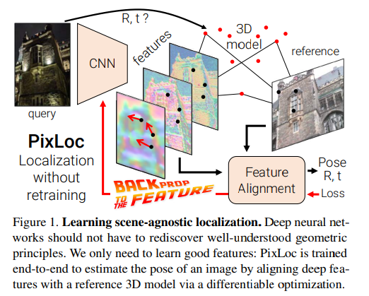

# Back to the Feature: Learning Robust Camera Localization from Pixels to Pose

**标题 & 年份：**2021

**作者：**Paul-Edouard Sarlin*, Ajaykumar Unagar*, Måns Larsson,

**Journal & doi：**CVPR

1)Read the title, abstract & introduction. 2) Read the sub-headings. 3) Read the conclusion. 4) Skim the references for familiar ones.

**1st pass (5 min)**

- 类别：Pose Estimate Algo
- 背景：许多从图像回归位姿和3D点的工作，都会在新的视角下失败，或者在需要对特定的场景，训练特定的模型参数；
  - 端到端的特征匹配：过程复杂，阻碍了梯度传播；
  - 直接回归位姿或像素点对应的3D坐标：针对特定场景，新场景或场景更新需要重新训练；

- 正确性：
- 贡献：
  - 提出：回到特征：深度学习还是应该关注学习鲁棒和不变的特征，计算位姿还是交给几何；
  - 算法可以在给出粗略位置先验的场景下定位，还可以通过联合细化关键点和位姿（计算量小）来提高稀疏特征匹配的准确性；

- 框架结构：
  - PixLoc: from pixels to pose
    -  Localization as image alignment
      - Image Representation
      - Direct alignment
      - Infusing visual priors
      - Fitting the optimizer to the data

    - Learning from poses
    -  Comparisons to existing approaches

  -  Localization pipeline :star:
  - Experiments
    - Comparison to learned approaches
    - Large-scale localization
    - Pose post-processing with PixLoc :star:
    - Additional insights

  - Conclusion

- 清晰度：`论文写得好吗?`

**是否值得继续读：**

pixloc需要查询帧的先验位置（使用参考帧的位姿 / GPS），还需要一个已建好的3D结构，这个需求看起来非常针对重定位……

**2nd pass (1 hour)**

- 介绍：

  - 算法基于多尺度深度特征的直接关联，通过分离模型参数和场景几何，实现在新场景下的泛化性能；

  - 算法通过提取查询帧的稠密特征，然后和场景的3D结构对齐，来定位查询帧；

    

- PixLoc: from pixels to pose：PixLoc localizes by aligning query and reference images according to the known 3D structure of the scene.

**3rd pass (4-5 hours)**

- 缺点：
  - 隐藏的假设：
  - 实验和分析上的疑点：
  - 缺失的引用：
- 优点：
  - 结论：
  - 可复用的技术：`表达或实现上的技术`
  - 隐藏的Efficacy：`作者没有提及，但是对我有利的点`

**参考文献**

[42] Mans Larsson, Erik Stenborg, Carl Toft, Lars Hammarstrand, ˚ Torsten Sattler, and Fredrik Kahl. Fine-Grained Segmentation Networks: Self-Supervised Segmentation for Improved LongTerm Visual Localization. In ICCV, 2019. 1, 2

[91] Lukas Von Stumberg, Patrick Wenzel, Nan Yang, and Daniel Cremers. LM-Reloc: Levenberg-Marquardt based direct visual relocalization. In 3DV, 2020. 2, 5