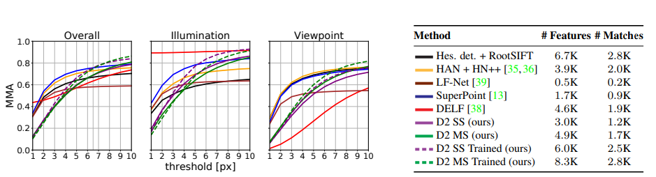

# D2-Net: A Trainable CNN for Joint Description and Detection of Local Features

**标题 & 年份：**2019

**作者 **& **Journal & doi：**Mihai Dusmanu, Ignacio Rocco, Tomas Pajdla, Marc Pollefeys, Josef Sivic, Akihiko Torii, Torsten Sattler; Proceedings of the IEEE/CVF Conference on Computer Vision and Pattern Recognition (CVPR), 2019, pp. 8092-8101

1)Read the title, abstract & introduction. 2) Read the sub-headings. 3) Read the conclusion. 4) Skim the references for familiar ones.

**1st pass (5 min)**

- 类别：New feature
- 背景：目前大量的稀疏局部特征提取，都是先检测特征点，然后再从特征点附近的patch提取描述子，输出一个对patch的表达；但是，它们在光照变化、季节变化、或弱纹理的场景表现较差，原因是keypoint detector缺乏可重复性，虽然描述子考虑到了更大的范围，潜在的编码的更高层的结构，但是keypoint detector只考虑了很小的范围；
- 正确性：
- 贡献：提出一种同时提取特征和描述子的网络；
  - 相比先基于低层的信息检测特征，我们先通过CNN计算feature map，然后检测特征，因此特征对应非常适合匹配的描述子，且CNN有助于特征提取和描述都基于更高层的信息；
  - 本算法不需要训练就已经获得了很好的性能，在MegaDepth上微调，还可以提升；

- 缺点：
  - 和传统特征相比，计算效率低；
  - 特征精度不够；

- 框架结构：
  - Joint Detection and Description Pipeline
    - 特征描述；
    - 特征提取；

  - Jointly optimizing detection and description :star:
    - Training loss
    -  Training Data
    -  Implementation detail

  - 实验评估:star:
    - Image Matching
    - 3D Reconstruction
    - Localization under Challenging Conditions

  - 总结：同贡献；
  - 展望：
    - 提升特征点检测的精度；
    - 将类似比率测试的目标集成到我们的损失中可以帮助提高我们的方法在 SfM 等应用中的性能；

- 清晰度：`论文写得好吗?`

**是否值得继续读：**

**2nd pass (1 hour)**

- Jointly optimizing detection and description 

  对于特征点，目标是提升可重复性，对于描述子，目标是提升区分度；

  - Training loss

    - 描述子区分度：
      - positive descriptor distance p(c) between the corresponding descriptors ：$p(c)=\left\|\hat{\mathbf{d}}_{A}^{(1)}-\hat{\mathbf{d}}_{B}^{(2)}\right\|_{2}$
      - The negative distance n(c)：$n(c)=\min \left(\left\|\hat{\mathbf{d}}_{A}^{(1)}-\hat{\mathbf{d}}_{N_{2}}^{(2)}\right\|_{2},\left\|\hat{\mathbf{d}}_{N_{1}}^{(1)}-\hat{\mathbf{d}}_{B}^{(2)}\right\|_{2}\right)$
      - $N_{1}=\underset{P \in I_{1}}{\arg \min }\left\|\hat{\mathbf{d}}_{P}^{(1)}-\hat{\mathbf{d}}_{B}^{(2)}\right\|_{2}$ s.t. $\|P-A\|_{\infty}>K$
      - The triplet margin ranking loss for a margin M can be then defined as：$m(c)=\max \left(0, M+p(c)^{2}-n(c)^{2}\right)$
      - 直觉上，这个loss通过惩罚那些confounding描述子，来增加描述的区分度；
    - 特征点可重复性：
      - $\mathcal{L}\left(I_{1}, I_{2}\right)=\sum_{c \in \mathcal{C}} \frac{s_{c}^{(1)} s_{c}^{(2)}}{\sum_{q \in \mathcal{C}} s_{q}^{(1)} s_{q}^{(2)}} m(p(c), n(c))$
      - $s_{c}^{(1)}$ and $s_{c}^{(2)}$是在点A和B的软性特征提取得分；`没有仔细看计算特征得分的算法`
      - 最终的loss是对m的基于特征提取得分的加权平均；

  -  Training Data

    - MegaDepth: 
      - 用colmap由1070468张图（稀疏）重建196个不同的场景；
      - 提供相机的内参和外参，以及来自Multi-View Stereo的102681张深度图；
    - 为了提取匹配对，我们首先选择所有（在稀疏SFM点云上）至少有50%重叠的图像对；
      - 对于所有图像对，第二张图上的所有点，通过深度信息投影到第一幅图像中，检查第一张图像的深度图，移除被遮挡的像素，最终获得327036个图像对；
      - 我们将数据集拆分为包含 18,149 个图像对（来自 78 个场景，每个场景 < 500 个图像对）的验证数据集和来自其余 118 个场景的训练数据集。

    > A-B positive descriptor distance和negative distance都是怎么来的？

  -  Implementation detail

- 实验评估

  - Image Matching

    - Dataset: HPatches；
      - Out of the 116 available sequences collected from various datasets，我们选择了其中的 108个（移除了其中1200 × 1600的，因为不是所有算法都可以处理这个分辨率的）；
      - 每个序列都包含光照变化（52）或视角变化（56）逐步增大的6个图像，对每个序列我们都匹配第一张和其他五张，因此产生了540个图像对；
    - Evaluation protocol: 
      - 对每个图像对，用nn找特征匹配，如果一个特征匹配的重投影误差小于阈值（`单应矩阵真值由数据集提供`），则判断匹配正确；
      - 我们变化阈值，记录所有匹配对的平均匹配精度（MMA），如每个图像对的匹配正确率（正确匹配数 / 总匹配对数）的平均值；

    

  - 3D Reconstruction

    - Dataset:
      - 使用三个小数据集：Madrid Metropolis, Gendarmenmarkt and Tower of London，因为小数据集可以使用详尽的图像匹配，避免使用场景识别；
    - Evaluation protocol: 
      - 和`Comparative evaluation of hand-crafted and learned local features` benchmark一致；

    

    (似乎是证明RootSIFT能打？)

  - Localization under Challenging Conditions

    - Dataset:
      - Aachen Day-Night dataset；
      - InLoc；
    - Evaluation protocol: 
      - 和长期视觉定位比赛保持一致；
      - 重定位的实现上，分别使用了2D-3D直接重定位和global-2D-3D重定位，测试重定位效果；

**3rd pass (4-5 hours)**

- 缺点：
  - 隐藏的假设：
  - 实验和分析上的疑点：
  - 缺失的引用：
- 优点：
  - 结论：
  - 可复用的技术：`表达或实现上的技术`
  - 隐藏的Efficacy：`作者没有提及，但是对我有利的点`

**参考文献**

[6] Vassileios Balntas, Edgar Riba, Daniel Ponsa, and Krystian Mikolajczyk. Learning local feature descriptors with triplets and shallow convolutional neural networks. In Proc. BMVC., 2016. 1, 2, 4

[35] Anastasiya Mishchuk, Dmytro Mishkin, Filip Radenovic, and Jiri Matas. Working hard to know your neighbor’s margins: Local descriptor learning loss. In NIPS, 2017. 4, 6, 7, 8, 10

[33] Krystian Mikolajczyk and Cordelia Schmid. A performance evaluation of local descriptors. IEEE PAMI, 27(10):1615– 1630, 2005. 1, 6
