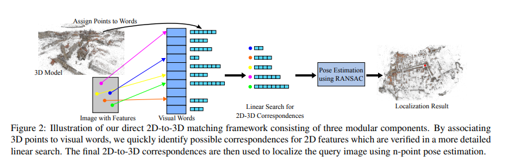

# Fast Image-Based Localization using Direct 2D-to-3D Matching

**标题 & 年份：**2011

**作者：**Torsten Sattler, Bastian Leibe

**Journal & doi：**ICCV

1)Read the title, abstract & introduction. 2) Read the sub-headings. 3) Read the conclusion. 4) Skim the references for familiar ones.

**1st pass (5 min)**

- 类别：`这是什么类型的论文?测量的论文吗?对现有系统的分析?研究原型的描述?`
- 背景：`它与其他哪些论文有关? 用哪些理论基础来分析这个问题?`
- 正确性：`假设看起来是有效的吗?`
- 贡献：`论文的主要贡献是什么?`
- 框架结构：
- 清晰度：`论文写得好吗?`

**是否值得继续读：**

**2nd pass (1 hour)**

`暂时没时间看了，这个相当于是对2D-3D匹配方案的参数（如码本的大小），有一个详细的测试`

**3rd pass (4-5 hours)**

- 缺点：
  - 隐藏的假设：
  - 实验和分析上的疑点：
  - 缺失的引用：
- 优点：
  - 结论：
  - 可复用的技术：`表达或实现上的技术`
  - 隐藏的Efficacy：`作者没有提及，但是对我有利的点`

