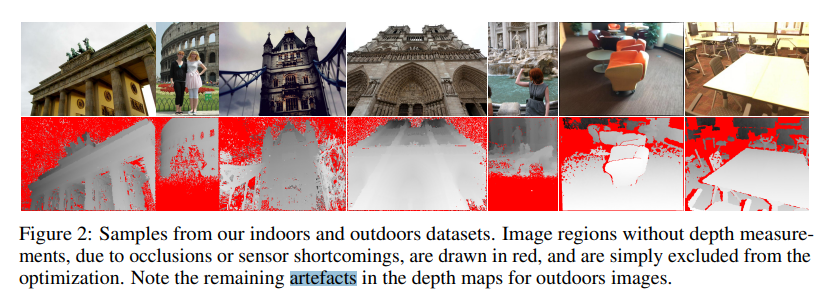

# LF-Net: Learning Local Features from Images

**标题 & 年份：**2018

**作者：**Yuki Ono, Eduard Trulls, Pascal Fua, Kwang Moo Yi

**Journal & doi：**CVPR 

1)Read the title, abstract & introduction. 2) Read the sub-headings. 3) Read the conclusion. 4) Skim the references for familiar ones.

**1st pass (5 min)**

- 类别：Feature

- 背景：匹配这个领域，提稀疏特征，进行匹配一直是标准流程，最近深度学习的星期，还衍生出一些稠密匹配的方案；

  - 稠密匹配：受遮挡的复杂场景会失败；

  - 稀疏匹配：

    - 有的只能分开训练特征提取的各个环节；

      当集成到完整的匹配pipeline，不一定会提升性能；

    - 有的端到端训练需要手工特征来初始化训练过程；

      手工特征遗漏的部分直接就放弃训练了；

- 正确性：

- 贡献：提出了一种局部特征训练策略；

  - 我们使用已知相对位姿和对应的深度图的图像对（可以用传感器获得深度图，也可以用shape-from-struction），在两个图像上选择大量的keypoints，给每个点计算描述子，然后用真值判断是否是正确的匹配，以此来学习好的描述子；

  > `不太懂`，大概翻译是，论文建议以不可微分的方式使用真值创建虚拟目标相应，具体来说，在第一个图像上运行检测器，找到最大值，然后优化权重，这样在第二个图像上运行时，产生一个响应图，在正确的位置有最大值。
  >
  > 此外，我们使用真值将选择的特征点warp到另一幅图像，保证有大量的真值匹配，虽然一个分支的可微性被破坏，但是可以端到端地训练另一个分支。

- 框架结构：

  - Method
    - LF-Net: a Local Feature Network
      - Feature map generation
      - Scale-invariant keypoint detection
      - Orientation estimation
      - Descriptor extraction

    - Learning LF-Net
      - Image-level loss
      - Patch-wise loss
      - Triplet loss for descriptors
      - Loss function for each sub-network

    - Technical details, otimization, and inference

  - Experiments
    -  Datasets
    - Baselines and metrics
    - Results on outdoors data
    - Results on indoors data
    - Ablation study

  -  Conclusions：提出一种输入图像集合，端到端训练特征提取的pipeline，不需要手工特征作为先验；

- 清晰度：`论文写得好吗?`

**是否值得继续读：**不看具体细节的话，我无法理解介绍部分；

**2nd pass (1 hour)**

- Method：

  - Technical details, otimization, and inference

    `不懂`

- Experiments

  -  Datasets: 

    - ScanNet

      

      - 数据集提供了图像和深度图；但是深度图是不完全的（因为传感器失败，尤其是在3D物体的边界处）;
      - 数据集提供了训练集、验证集、测试集，但我们只使用了大概一半的训练数据和验证数据，测试集使用了完整的312个序列；

    - photo-tourism

      - 将数据集利用colmap进行稠密重建，同时可以获得每张图的深度图，但是是存在遮挡和噪声的；
      - 通过将每张图片上的像素点根据重建位姿和深度图投影到3D空间，如果投影点距最相近的3D点超过阈值，就标记为无效；（这样处理过之后虽然还是有噪声，但是已经去掉很多受遮挡影响的点了）
      - 为了确保图像对重叠的程度合理，我们会做可视检查，考虑包围图像对的匹配点（重建结果给出）的两个bound-box，当bound-box非常小的时候，丢弃掉；
      - 使用14个序列作为训练集和验证集，按7:3的比率划分，然后每个不同的场景采样50k个匹配对；
      - 使用剩余的11个序列作为测试集，每个序列采样1k个匹配对；

  - Baselines and metrics

    - 匹配得分：正确匹配数 / nn估计的匹配数

      > 使用了ratio-test来排除错配吗？如果有各种算法都使用什么ratio阈值呢？
      >
      > 应该没有吧……就直接体现nn可以找到多少正确匹配，也很公平；

  - Results on outdoors data

  - Results on indoors data

**3rd pass (4-5 hours)**

- 缺点：
  - 隐藏的假设：
  - 实验和分析上的疑点：
  - 缺失的引用：
- 优点：
  - 结论：
  - 可复用的技术：`表达或实现上的技术`
  - 隐藏的Efficacy：`作者没有提及，但是对我有利的点`

