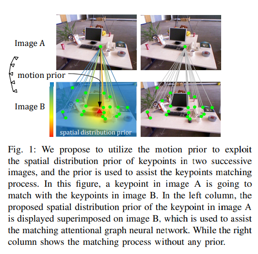

# Probabilistic Spatial Distribution Prior Based Attentional Keypoints Matching Network
**标题 & 年份：**

**作者：**Xiaoming Zhao, Jingmeng Liu, Xingming Wu

**Journal & doi：** [IEEE Transactions on Circuits and Systems for Video Technology](https://ieeexplore.ieee.org/xpl/RecentIssue.jsp?punumber=76) ( Early Access )

1)Read the title, abstract & introduction. 2) Read the sub-headings. 3) Read the conclusion. 4) Skim the references for familiar ones.

**1st pass (5 min)**

- 类别：match algo

- 背景：

  - 视觉匹配领域还没有考虑到结合其他传感器来改进匹配；

- 正确性：`假设看起来是有效的吗?`

- 贡献：

  - 提出使用IMU预积分来获得图像之间的关键点的先验分布，设计了一个概率注意力GNN；
  - 设计了projection loss（使用重投影误差作为loss），而不是the hard-threshold ground-truth matches，来监督训练；

- 框架结构：

  

  - method

    - pipeline overview

    -  Spatial distribution prior module

    - Attentional GNN for keypoints matching

    - Prior Assisted Attentional GNN for keypoints matching

      在聚合信息的环节，会先计算其他点关于聚合点的权重；

      - 一种是把先验权重直接叠加到计算完的权重里；
      - 一种是把先验权重嵌入到权重计算里；

    - Loss functions

  - 实验

- 清晰度：`论文写得好吗?`

**是否值得继续读：**

利用IMU先验增加权重；

1. 只有相邻帧之间可用；
2. 它的实验分析没有表现出性能上超过superglue；

**2nd pass (1 hour)**

这部分的笔记不一定要记在这里，这部分可以按之前我按内容分类记录的文档上。

**3rd pass (4-5 hours)**

- 缺点：
  - 隐藏的假设：
  - 实验和分析上的疑点：
  - 缺失的引用：
- 优点：
  - 结论：
  - 可复用的技术：`表达或实现上的技术`
  - 隐藏的Efficacy：`作者没有提及，但是对我有利的点`

