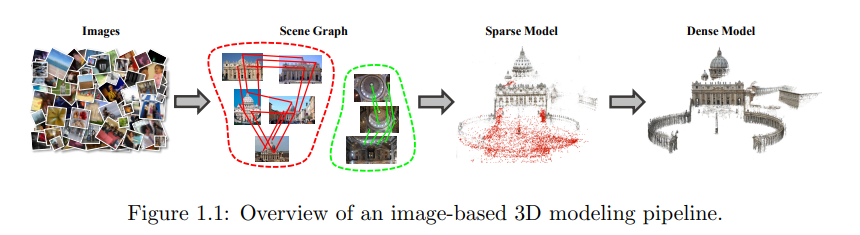
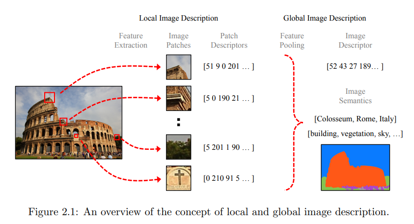
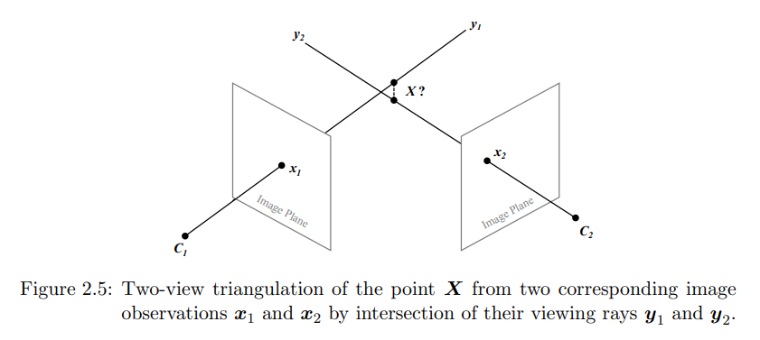
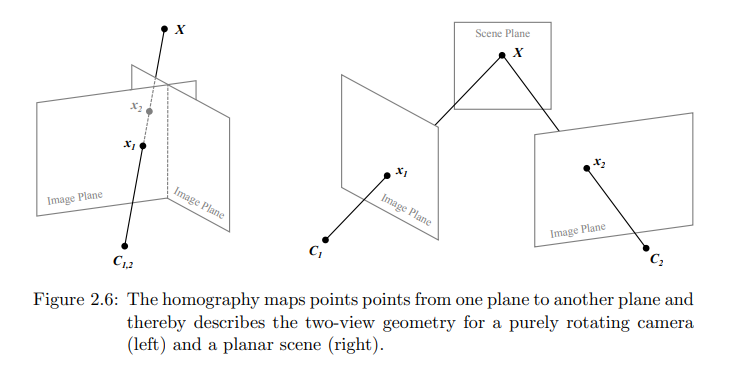

# Robust Methods for Accurate and Efficient 3D Modeling from Unstructured Imagery

**标题 & 年份：**2018

**作者：**Johannes Lutz Sch¨onberger

**Journal & doi：**

1)Read the title, abstract & introduction. 2) Read the sub-headings. 3) Read the conclusion. 4) Skim the references for familiar ones.

**1st pass (5 min)**

- 类别：博士论文

- 背景：

- 正确性：`假设看起来是有效的吗?`

- 贡献：提出了一些算法提升基于图像的3D建图的鲁棒性、精度、完整性和效率，并且在现实世界的真实数据、标准的benchmark上进行评价和分析；

  - 通过实验评价学习特征和手工特征建图的性能；

    > 对应论文：Comparative Evaluation of Hand-Crafted and Learned Local Features

  - 三种加速匹配搜索的方案；

    > 重定位方案具有 3D模型，这里只有2D特征，方案设计上肯定会有差异；

  - 几种提升增量式建图的策略；

    > 对应论文：Structure-from-Motion Revisited

  - 基于学习的提升稠密双目重建的方法；

  - MVS算法重建稠密点云；

    > 稠密重建方面我暂时不关心；

  - 提出了一种大规模图像集的端到端的重建系统，方法紧密继承了图像检索和3D建模组件，将系统场景的单个查询图像作为输入，并基于大量的图像数据增量式重建整个场景详细且准确的3D模型；

    > 对应论文：From Single Image Query to Detailed 3D Reconstruction

  - 提出一个光照鲁棒的3D建模系统，从混合白天和夜晚的图像数据建模；

  - 鲁棒的视觉定位方案，基于联合语义和几何；

- 框架结构：

  - 【2】principles in computer vision, (multi-view) geometry, and optimization :star:

  - 【3】评价学习特征和手工特征建图的性能；

  - 【4 5 6】三种加速稀疏双视图估计的算法；:star:

  - 【7】几种提升增量式建图的策略；:star:

  - 【8】基于学习的提升稠密双目重建的方法；

  - 【9】MVS算法重建稠密点云；

  - 【10】用单张查询图像，产生一个详细的3D模型的端到端的重建系统；

  - 【11】提出一个光照鲁棒的3D建模系统，从混合白天和夜晚的图像数据建模；

  - 【12】鲁棒的视觉定位方案，基于联合语义和几何；

  - 【13 14】总结理论，对开放问题和未来工作的展望；:star:

    

- 清晰度：`论文写得好吗?`

**是否值得继续读：**

**2nd pass (1 hour)**

- Overview

  - Motivation

    > - 不同的任务对建图这个任务的侧重点都不一样，比如质量检测任务，要求精确地测量和准确地重建，但是对于可视化任务，更关注的是逼真程度和视觉友好，而不在以底层3D模型的准确性；
    > - 视觉恢复的3D模型没有尺度，需要尺度先验，纯视觉的系统怎么和IMU紧耦合起来？`看vins-mono`
    > - colmap怎么处理事先没有标定的相机的？

  - System

    SFM典型的分为三步：

    

    1. 搜索场景重叠和图像中的对应结构，构成场景图——连结多个图像中对应的objects；
    2. 稀疏建图：这一步会恢复相机的内参（焦距、畸变）和外参（位置和姿态），以及场景的3D稀疏点云；
    3. 稠密建图：使用稀疏的点云和标定好的相机重建稠密场景（稠密点云或textured surface mesh）；

- Principles

  - Image Description

    为了重建3D结构，需要知道图像之间的几何关系：

    1. 对输入图片独立描述；
    2. 找到描述相同场景结构的图像；

    - 对图片的描述：

      - 全局 / 局部；

        全局的描述精度不够，但是可以高效地在大量的数据中建立关联和分类；

      - 分类等级 / 实例等级；

    - Local Image Description

      基于图像的3D模型，稀疏的局部特征几乎是必须的，因为它可以鲁棒且高效地参数化几何重建问题；

      通常用成百上千的局部特征来encode图像，通过匹配表示同一场景的图像的局部特征，建立像素级对应（这是建立几何关系必须的）；

    - Global Image Description

      用单个描述子表示图像；

      - bag-of-words；

        优点是，局部特征和全局描述是紧耦合的；

      - 学习图像的全局描述；

        - 端到端训练的卷积神经网络直接学习回归一个固定尺寸的、编码了空间或语义信息的向量；

        - 因为编码了空间和语义信息，图像检索更准确；

  - Multi-View Geometry

    - Pinhole Camera

      $\boldsymbol{x} \simeq \lambda\left[\begin{array}{lll}u & v & 1\end{array}\right]^{T}=\boldsymbol{P} \boldsymbol{X}=\boldsymbol{K}\left[\begin{array}{ll}\boldsymbol{R} & \boldsymbol{T}\end{array}\right] \boldsymbol{X}=\boldsymbol{K}\left[\begin{array}{ll}\boldsymbol{R} & -\boldsymbol{R}^{T} \boldsymbol{C}\end{array}\right] \boldsymbol{X}$

    - Camera Calibration

      $\boldsymbol{x} \simeq \boldsymbol{P} \boldsymbol{X}=\left[\begin{array}{c}\boldsymbol{P}_{1}^{T} \\ \boldsymbol{P}_{2}^{T} \\ \boldsymbol{P}_{3}^{T}\end{array}\right] \boldsymbol{X}$

      在排除了一个不知道的尺度因子后，上式等价为：

      $\begin{array}{l}\boldsymbol{P}_{3}^{T} \boldsymbol{X} u=\boldsymbol{P}_{1}^{T} \boldsymbol{X} \\ \boldsymbol{P}_{3}^{T} \boldsymbol{X} v=\boldsymbol{P}_{2}^{T} \boldsymbol{X}\end{array} \quad \Rightarrow \quad \mathbf{0}=\boldsymbol{A}\left[\begin{array}{l}\boldsymbol{P}_{1} \\ \boldsymbol{P}_{2} \\ \boldsymbol{P}_{3}\end{array}\right]=\left[\begin{array}{ccc}\boldsymbol{X}^{T} & 0 & -\boldsymbol{X}^{T} u \\ 0 & \boldsymbol{X}^{T} & -\boldsymbol{X}^{T} v\end{array}\right]\left[\begin{array}{l}\boldsymbol{P}_{1} \\ \boldsymbol{P}_{2} \\ \boldsymbol{P}_{3}\end{array}\right]$

      > 可以看出一对2D-3D点提供两维的约束；

      - 解是矩阵A的零空间，因此对应 对A做SVD分解，最小奇异值对应的特征向量；

      - 投影矩阵P可以用RQ分解为内参和外参矩阵，因为标定矩阵K是上三角矩阵，而R是正交矩阵；

      此外，真实世界的相机还存在复杂的畸变，如：径向畸变系数 k1, k2...

      $\tilde{\boldsymbol{x}}=f_{\text {dist }}(\boldsymbol{x})=\left[\begin{array}{ll}u & v\end{array}\right]^{T}\left(1+k_{1} r^{2}+k_{2} r^{4}+\ldots\right)+\ldots \quad$ with $\quad r^{2}=u^{2}+v^{2}$

      > 选择合适的相机模型是至关重要的，如果是复杂的畸变模型，最好是预先精确地标定，然而有些场景需要在重建时分别标定每一张图片，这种就不要使用太复杂的畸变模型，因为来自单个图像的观察数据不足；

    - 三角化

      

      $\boldsymbol{y}_{1}=\lambda \boldsymbol{y}_{2} \quad$ with $\quad \lambda \neq 0$

      核心就是恢复尺度$\lambda$，因为在3D-2D投影的过程中丢失了深度信息；

      - 对于单张图像，给出相机内参和外参和尺度因子，可以计算3D位置：

        $\overline{\boldsymbol{X}}=\lambda \boldsymbol{R}^{T} \boldsymbol{K}^{-1} \boldsymbol{x}+\boldsymbol{C}$

      - 在没有先验$\lambda$的情况下，点的位置可以由多张图上，对应2D点的光心射线的交点决定，类似于标定的公式，可以用直接线性变换求：

        $\begin{array}{l}\boldsymbol{P}_{3}^{T} \boldsymbol{X} u=\boldsymbol{P}_{1}^{T} \boldsymbol{X} \\ \boldsymbol{P}_{3}^{T} \boldsymbol{X} v=\boldsymbol{P}_{2}^{T} \boldsymbol{X}\end{array} \quad \Rightarrow \quad \mathbf{0}=\left[\begin{array}{l}\boldsymbol{P}_{3}^{T} u-\boldsymbol{P}_{1}^{T} \\ \boldsymbol{P}_{3}^{T} v-\boldsymbol{P}_{2}^{T}\end{array}\right] \boldsymbol{X}$

        > 真的太相似了，只是上面是为了求P，下面是为了求X；

        最少需要不同图像上的两个观测点；（X是三自由度，一对2D-3D带来两自由度的约束）

        两对2D-3D带来四个自由度的约束，观测含有噪声，造成这一个冗余的自由度的约束，表现出来是，两条射线不会在一点相交；

        > 还要注意，如果相机沿光轴运动，或相机仅旋转不平移，三角化是退化的，因为光轴所有的点都是满足条件的；

    -  Two-View Geometry

      它可以用来描述经历不同类型运动的相机的两个视图之间的几何关系，而无需显式恢复场景的欧几里得结构；

      - 单应变换

        

        > 单应变换具有保线：, any three points y1 , y2 , y3 are collinear if and only if they are collinear in h(y1 ), h(y2 ), h(y3 ).

        $\boldsymbol{x}_{2} \simeq \lambda_{2}\left[\begin{array}{lll}u_{2} & v_{2} & 1\end{array}\right]^{T}=h\left(\boldsymbol{x}_{1}\right)=\boldsymbol{H} \boldsymbol{x}_{1}=\left[\begin{array}{l}\boldsymbol{H}_{1}^{T} \\ \boldsymbol{H}_{2}^{T} \\ \boldsymbol{H}_{3}^{T}\end{array}\right] \boldsymbol{x}_{1}=\left[\begin{array}{lll}h_{11} & h_{12} & h_{13} \\ h_{21} & h_{22} & h_{23} \\ h_{31} & h_{32} & h_{33}\end{array}\right] \boldsymbol{x}_{1}$

        单应矩阵的自由度为8，因为它是齐次的，因此需要至少4对点求解；

        $\begin{aligned} \boldsymbol{H}_{3}^{T} \boldsymbol{x}_{1} u_{2} &=\boldsymbol{H}_{1}^{T} \boldsymbol{x}_{1} \\ \boldsymbol{H}_{3}^{T} \boldsymbol{x}_{1} v_{2} &=\boldsymbol{H}_{2}^{T} \boldsymbol{x}_{1} \end{aligned} \quad \Rightarrow \quad \mathbf{0}=\left[\begin{array}{ccc}\boldsymbol{x}_{1}^{T} & 0 & -\boldsymbol{x}_{1}^{T} u_{2} \\ 0 & \boldsymbol{x}_{1}^{T} & -\boldsymbol{x}_{1}^{T} v_{2}\end{array}\right]\left[\begin{array}{l}\boldsymbol{H}_{1} \\ \boldsymbol{H}_{2} \\ \boldsymbol{H}_{3}\end{array}\right]$

        求解单应矩阵后，可以分解为：

        $\boldsymbol{H}=\boldsymbol{K}_{2}\left(\boldsymbol{R}_{2}-\frac{\boldsymbol{T}_{2} \boldsymbol{N}^{T}}{d}\right) \boldsymbol{K}_{1}^{-1}$

        其中N是Scene Plane的单位法向量，d是场景平面到第一个摄像机的投影中心的正交距离；

        

    

  

  

**3rd pass (4-5 hours)**

- 缺点：
  - 隐藏的假设：
  - 实验和分析上的疑点：
  - 缺失的引用：
- 优点：
  - 结论：
  - 可复用的技术：`表达或实现上的技术`
  - 隐藏的Efficacy：`作者没有提及，但是对我有利的点`

**参考文献**

- 两视图

  [283] J. L. Sch¨onberger, A. C. Berg, and J.-M. Frahm. “PAIGE: PAirwise Image Geometry Encoding for Improved Efficiency in Structure-from-Motion”. In: Conference on Computer Vision and Pattern Recognition (CVPR). 2015.

  [287] J. L. Sch¨onberger∗ , T. Price∗ , T. Sattler, J.-M. Frahm, and M. Pollefeys. “A Vote-and-Verify Strategy for Fast Spatial Verification in Image Retrieval”. In: Asian Conference on Computer Vision (ACCV). ∗Equal contribution. 2016.

  [288] J. L. Sch¨onberger, F. Radenovi´c, O. Chum, and J.-M. Frahm. “From Single Image Query to Detailed 3D Reconstruction”. In: Conference on Computer Vision and Pattern Recognition (CVPR). 2015.

- 建图

  [252] F. Radenovi´c, J. L. Sch¨onberger, D. Ji, J.-M. Frahm, O. Chum, and J. Matas. “From Dusk till Dawn: Modeling in the Dark”. In: Conference on Computer Vision and Pattern Recognition (CVPR). 2016

- 定位

  [286] J. L. Sch¨onberger, M. Pollefeys, A. Geiger, and T. Sattler. “Semantic Visual Localization”. In: Conference on Computer Vision and Pattern Recognition (CVPR). 2018.