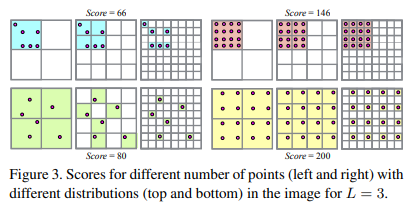
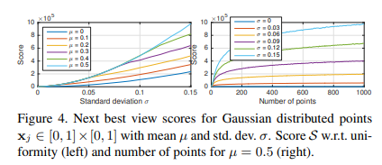

# Structure-from-Motion Revisited

**标题 & 年份：**2016

**作者：**Johannes L. Schonberger, Jan-Michael Frahm

**Journal & doi：**Proceedings of the IEEE Conference on Computer Vision and Pattern Recognition (CVPR), 2016, pp. 4104-4113

1)Read the title, abstract & introduction. 2) Read the sub-headings. 3) Read the conclusion. 4) Skim the references for familiar ones.

**1st pass (5 min)**

- 类别：对增量式SFM框架和理论的阐述；
- 背景：SFM
- 正确性：时间证明了有效。
- 贡献：一个建图鲁棒、完整、准确、可扩展的SFM pipeline。
- 框架结构：
  - 回顾SFM：
    - 匹配搜索；
      - 特征提取；
      - 特征匹配；
      - 几何验证；

    - 增量式建图；
      - 初始化；
      - 图像注册；
      - 三角化；
      - BA；

  - 存在的挑战；
  - 论文所述工作的贡献；
    - 场景图增强；
    - 下一个最佳视图的选择；
    - 鲁棒且有效的三角化：场景结构更完整、计算复杂度更小；
    - BA；
      - 参数化；
      - 过滤；
      - 重新三角化；
      - 迭代的细化；

    - 冗余视图挖掘；

  - 实验：对工作的贡献，逐个测评；

- 清晰度：好

**是否值得继续读：**对SFM的回顾和论文的贡献可以作为我了解SFM的开始；

**2nd pass (1 hour)**

- Review of Structure-from-Motion

  - Correspondence Search

    输入：N张图像；

    输出：完成几何验证的图像对，和每个3D在图像上投影的graph；

    - 特征提取；

    - 匹配：输出一组可能overlap的图像对，和它们的特征匹配；

      -- 每个图像遍历所有图像，每个特征遍历对应图像的所有特征，时间复杂度是$O\left(N_{I}^{2} N_{F_{i}}^{2}\right)$，大部分工作都把这个环节做成可扩展的了；

    - 几何验证：

      -- 单应矩阵描述了纯旋转，或移动的相机拍摄到平面；

      -- 设计了`运动模型选择的标准`；（目前被我改成了只使用E，但还是有必要了解设计的原因，和适用的条件）

      -- 输出是场景图，图像是Node，通过验证的图像对是边；

  - 增量式建图

    输入：场景图；

    输出：注册的图像的位姿，重建的场景结构（3D点）；

    - 初始化：选择合适的初始化图像对至关重要；

      -- 重场景图中稠密的位置初始化（边最多的node），建图会更鲁棒和准确；

      -- 相对的，从稀疏的位置初始化，可以减少运行时间；

    - 图像注册：新的图像注册到当前的模型：使用图像上的2D点和已三角化的3D点对，`解PnP问题`，得到图像的位姿，对于没有标定的相机，还会求解内参；

      -- 下一个注册图像的选择；

    - 三角化：利用新注册的图像，注册新的3D点；

      -- 提出了一种鲁棒的三角化方法；

      -- 有大量的多视图三角化方案存在；

    - ==BA==：前面图像注册和3D点注册是分开的，不确定性从图像传递到3D点，反之亦然，如果不做全局的调整（类似回环吗？），SFM会漂掉，BA联合非线性优化相机参数（位姿、内参）和点，最小化重投影误差：$E=\sum_{j} \rho_{j}\left(\left\|\pi\left(\mathbf{P}_{c}, \mathbf{X}_{k}\right)-\mathbf{x}_{j}\right\|_{2}^{2}\right)$；

      -- 特殊的参数结构，使得可以使用`舒尔补`技巧；`看MVG上关于BA的部分`

      -- 提出了一种定义和参数化高度重叠的图像的方案，在密集的图像集上高效的BA；

- 挑战

  - 目前的SFM算法在完整性和鲁棒性上经常跪；
    - 匹配找的不够；
    - 缺失 / 不正确的场景结构：图像注册和三角化是共生关系，图像只能注册到已有的场景结构（3D点），而场景结构只能由已经注册的图像三角化出来；

- 贡献

  - 场景图增强

    多模型几何验证策略（目前被我关了……）；`Water Mark？`

    -- 后续喂给重建的种子来自non-panoramic和已标定的；

    -- 后续将不三角化纯旋转的点，避免退化的点；`应该仅关掉F的估计`

  - 下一个最佳视图的选择：

    - 选择至少已经有$N_t$个点被三角化的图像：

      -- 维护一个特征点track图：对于网络数据集而言，这个图会非常的稠密，因为许多图像都看到了相似的结构；

    - 同时维护每个候选图像上可视的点的数量和分布；

      

      多分辨率计分，各层权重等于$K_l=2^l,w_l=K^2_l$,分布越不均匀，得分越高；

  - 鲁棒和高效的三角化

    :star: 利用传递对应关系提升三角化的完整性和准确度，匹配的技术限制了找到的匹配图像对是外观相似的，所以双视图对应的结果经常受限于窄基线。利用传递关系可以建立更宽基线的匹配，从而使三角化更加准确；

    ==注：==这也是重定位任务和建图任务不一样的点，重定位任务更可能匹配到宽基线；

    - 提出了一种基于采样的三角化方法，可以在有外点污染track的情况下，鲁棒的估计所有的点；`作者统计过外点率多高的都有`

      -- 经过几何验证外点依然很多，建明希望SuperGlue实现的是减少匹配这个阶段的误匹配；

    - Bundler的做法：对track里的元素成对采样，计算双视图三角化，如果其中有至少一个算出了合理的三角化角度，就在整条track上做多视图三角化，然后如果track里所有的特征点都符合cheirality constraint，这个3D就通过了；

      注：一条track对应的就是一个3D点；

      - 这个方案对外点还是不够鲁棒；
      - 它不能恢复被错误的merge到一条track里的多个点；
      - 计算成本高：对track详尽的成对采样；

    - 配合RANSAC来做三角化，最小的配置双视图就是三角化的最小配置：$\mathbf{X}_{a b} \sim \tau\left(\overline{\mathbf{x}}_{a}, \overline{\mathbf{x}}_{b}, \mathbf{P}_{a}, \mathbf{P}_{b}\right)$ with $a \neq b$

      - where τ is any chosen triangulation method (in our case the DLT method).
      - :star: 因为一个track里包含多个独立的点，在筛出一个点后，还会对剩余的特征递归的进行ransac三角化3D点的过程，如果最新的consensus set的大小小于3了，就停止递归。

  - BA

    为了缓解累积的误差，在完成一帧的图像注册和三角化后，会进行BA。通常没有必要进行全局的BA，因为增量式的SFM只影响模型的局部。因此，会在每一帧注册后对与这一帧most-connected的图像local BA。

    - 参数化：local BA使用Cauchy function作为损失函数，对网络上的图像数据，仅使用有一个径向畸变参数的相机模型，模型参数估计纯粹依赖自标定（似乎是指建图时，一起优化）；

    - Filter：

      - 过滤重投影误差较大的点；

      ==注：==这个流程和标定好像哦；

      - 对每个地图点要满足最小的三角化夹角；
      - global BA之后也会过滤退化的cameras，如：仅有旋转的的图，这些相机可能只有outlier观测（视角异常），或者它们的内参收敛到一个虚假的最小值（畸变系数的幅度过大）；

      ==注：==提到主点的标定是一个不适定问题；

    - Re-Triangulation：

      - 在global-BA 前会重新三角化；
      - 在BA后也会在做一次三角化（因为BA应该是改善了位姿和点的），post-BA 会使用之前三角化失败的tracks（可能是因为之前位姿不准，三角化失败），不过在这一步提高了三角化阈值，而且只continue观测的误差小于filter阈值的tracks；
      - 此外，在Re-Triangulation的环节，还会merge tracks。

      :triangular_flag_on_post: 这部分不太明白，需要对照代码实现；

    - 迭代优化：因为漂移或pre-BA RT，通常BA后，大部分观测点是异常值，随后被filter，由于这一步BA受到异常值严重影响，再进行一步BA可以改善结果；

      BA、RT、filtering迭代执行，直到滤除对观测和RT点较少；

  - Redundant View Mining `暂留，看参考论文`

    将场景高度重叠的相机聚类到一个组里；:triangular_flag_on_post: 这部分不太明白，需要看参考的论文；

- 实验

  - Next Best View Selection.

    

    

  

  

  

  

  

  

  

  

  

  

  

**3rd pass (4-5 hours)**

- 缺点：
  - 隐藏的假设：
  - 实验和分析上的疑点：
  - 缺失的引用：
- 优点：
  - 结论：
  - 可复用的技术：`表达或实现上的技术`
  - 隐藏的Efficacy：`作者没有提及，但是对我有利的点`

**参考论文**

[30] J. Heinly, J. L. Schonberger, E. Dunn, and J.-M. Frahm. Re- ¨ constructing the World* in Six Days *(As Captured by the Yahoo 100 Million Image Dataset). CVPR, 2015. 1, 2, 3

**增量式建图**

[53] N. Snavely, S. Seitz, and R. Szeliski. Photo tourism: exploring photo collections in 3d. ACM TOG, 2006. 1, 4, 5, 6

 [1] S. Agarwal, Y. Furukawa, N. Snavely, I. Simon, B. Curless, S. Seitz, and R. Szeliski. Building rome in a day. ICCV, 2009. 1, 2

[20] J.-M. Frahm, P. Fite-Georgel, D. Gallup, T. Johnson, R. Raguram, C. Wu, Y.-H. Jen, E. Dunn, B. Clipp, S. Lazebnik, and M. Pollefeys. Building Rome on a Cloudless Day. ECCV, 2010. 1, 2, 3

[62] C. Wu. Towards linear-time incremental structure from motion. 3DV, 2013. 1, 2, 3, 5, 6, 7

**分层建图**

[23] R. Gherardi, M. Farenzena, and A. Fusiello. Improving the efficiency of hierarchical structure-and-motion. CVPR, 2010. 1

**全局建图**

[14] D. Crandall, A. Owens, N. Snavely, and D. P. Huttenlocher. Discrete-Continuous Optimization for Large-Scale Structure from Motion. CVPR, 2011. 1, 7, 8

[61] K. Wilson and N. Snavely. Robust global translations with 1dsfm. ECCV, 2014. 1, 8

[56] C. Sweeney, T. Sattler, T. Hollerer, M. Turk, and M. Pollefeys. Optimizing the viewing graph for structure-frommotion. CVPR, 2015. 1

**几何验证**

[57] P. H. Torr. An assessment of information criteria for motion model selection. CVPR, 1997. 2

**图像注册**

[34] V. Lepetit, F. Moreno-Noguer, and P. Fua. EPnP: An accurate O(n) solution to the PnP problem. IJCV, 2009. 2, 4

[31] A. Irschara, C. Zach, J.-M. Frahm, and H. Bischof. From structure-from-motion point clouds to fast location recognition. CVPR, 2009. 2, 4

**三角化**

[32] L. Kang, L. Wu, and Y.-H. Yang. Robust multi-view l2 triangulation via optimal inlier selection and 3d structure refinement. Pattern Recognition, 2014. 2, 4, 5

**BA**

[13] Y. Chen, T. A. Davis, W. W. Hager, and S. Rajamanickam. Algorithm 887: Cholmod, supernodal sparse cholesky factorization and update/downdate. ACM TOMS, 2008. 3

[38] M. I. Lourakis and A. A. Argyros. SBA: A software package for generic sparse bundle adjustment. ACM TOMS, 2009. 3

[63] C. Wu, S. Agarwal, B. Curless, and S. Seitz. Multicore bundle adjustment. CVPR, 2011. 3

:star: [4] S. Agarwal, N. Snavely, S. Seitz, and R. Szeliski. Bundle adjustment in the large. ECCV, 2010. 3

:star: [54] N. Snavely, S. Seitz, and R. Szeliski. Skeletal graphs for efficient structure from motion. CVPR, 2008. 2, 3

[43] K. Ni, D. Steedly, and F. Dellaert. Out-of-core bundle adjustment for large-scale 3d reconstruction. ICCV, 2007. 6

[11] L. Carlone, P. Fernandez Alcantarilla, H.-P. Chiu, Z. Kira, and F. Dellaert. Mining structure fragments for smart bundle adjustment. BMVC, 2014. 6

**缺失结构**

[64] E. Zheng and C. Wu. Structure from motion using structureless resection. ICCV, 2015. 3

**WaterMark**

[60] T. Weyand, C.-Y. Tsai, and B. Leibe. Fixing wtfs: Detecting image matches caused by watermarks, timestamps, and frames in internet photos. WACV, 2015. 3

[30] J. Heinly, J. L. Schonberger, E. Dunn, and J.-M. Frahm. Re- ¨ constructing the World* in Six Days *(As Captured by the Yahoo 100 Million Image Dataset). CVPR, 2015. 1, 2, 3

**标定**

[15] L. de Agapito, E. Hayman, and I. Reid. Self-calibration of a rotating camera with varying intrinsic parameters. BMVC, 1998. 6

