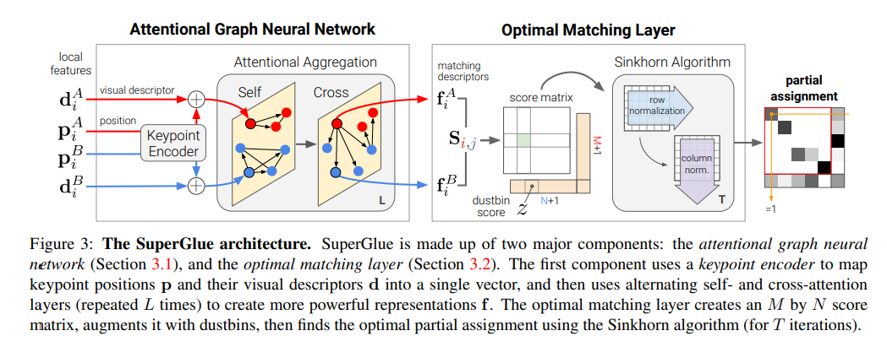

# SuperGlue: Learning Feature Matching with Graph Neural Networks

**标题 & 年份：**2020

**作者：**Paul-Edouard Sarlin1∗ Daniel DeTone2

**Journal & doi：**CVPR

1)Read the title, abstract & introduction. 2) Read the sub-headings. 3) Read the conclusion. 4) Skim the references for familiar ones.

**1st pass (5 min)**

- 类别：DeepLearning
- 背景：
- 正确性：`假设看起来是有效的吗?`
- 贡献：`论文的主要贡献是什么?`
- 框架结构：
- 清晰度：`论文写得好吗?`

**是否值得继续读：**

**2nd pass (1 hour)**

- The SuperGlue Architecture

  - Motivation: 有效的匹配应该是：找到所有对应同一个3D点的特征点对，并且可以识别没有匹配的特征；

  - Formulation: $\mathbf{P} \mathbf{1}_{N} \leq \mathbf{1}_{M} \quad$ and $\quad \mathbf{P}^{\top} \mathbf{1}_{M} \leq \mathbf{1}_{N}$，$\mathbf{P} \in[0,1]^{M \times N}$

    

    > 最后生成的P矩阵有点像数独游戏；

  -  Attentional Graph Neural Network

    - Keypoint Encoder: ${ }^{(0)} \mathbf{x}_{i}=\mathbf{d}_{i}+\operatorname{MLP}_{\mathrm{enc}}\left(\mathbf{p}_{i}\right)$

    - Multiplex Graph Neural Network

      - GNN 使用信息聚合公式传递其他节点的信息；

      - 对每个node而言，GNN从高维的状态开始，在每一层同时聚合来自所有节点的信息，来计算和更新节点的表达；

      Let ${ }^{(\ell)} \mathbf{x}_{i}^{A}$ be the intermediate representation for element $i$ in image $A$ at layer $\ell$. The message $\mathbf{m}_{\mathcal{E} \rightarrow i}$ is the result of the aggregation from all keypoints $\{j:(i, j) \in \mathcal{E}\}$, where $\mathcal{E} \in\left\{\mathcal{E}_{\text {self }}, \mathcal{E}_{\text {cross }}\right\}$. The residual message passing update for all $i$ in $A$ is: ${ }^{(\ell+1)} \mathbf{x}_{i}^{A}={ }^{(\ell)} \mathbf{x}_{i}^{A}+\operatorname{MLP}\left(\left[{ }^{(\ell)} \mathbf{x}_{i}^{A} \| \mathbf{m}_{\mathcal{E} \rightarrow i}\right]\right)$；

      其中，$[\cdot \| \cdot]$代表拼接，奇数层和自己聚合，偶数层和图像对聚合；

    - Attentional Aggregation

      $\mathbf{m}_{\mathcal{E} \rightarrow i}=\sum_{j:(i, j) \in \mathcal{E}} \alpha_{i j} \mathbf{v}_{j}$

      $\alpha_{i j}=\operatorname{Softmax}_{j}\left(\mathbf{q}_{i}^{\top} \mathbf{k}_{j}\right)$

      The key, query, and value are computed as linear projections of deep features of the graph neural network.

      $\begin{aligned} \mathbf{q}_{i} &=\mathbf{W}_{1}{ }^{(\ell)} \mathbf{x}_{i}^{Q}+\mathbf{b}_{1} \\\left[\begin{array}{c}\mathbf{k}_{j} \\ \mathbf{v}_{j}\end{array}\right] &=\left[\begin{array}{l}\mathbf{W}_{2} \\ \mathbf{W}_{3}\end{array}\right]{ }^{(\ell)} \mathbf{x}_{j}^{S}+\left[\begin{array}{l}\mathbf{b}_{2} \\ \mathbf{b}_{3}\end{array}\right] \end{aligned}$

      其中，Q是查询图像，S代表源图像，可以是自己，也可以是图像对；

      > 1. 实践中会使用多头attention，来提升效率；
      > 2. SuperGlue相当于同时关注特征的外观和位置，这包括关注附近的关键点，并检索相似或者显著关键点的相对位置；

      再做一步线性投影：$\mathbf{f}_{i}^{A}=\mathbf{W} \cdot{ }^{(L)} \mathbf{x}_{i}^{A}+\mathbf{b}, \quad \forall i \in \mathcal{A}$

  -  Optimal matching layer

    标准的图匹配公式，会计算一个得分矩阵$\mathbf{S} \in \mathbb{R} M \times N$，并最大化总得分$\sum_{i, j} \mathbf{S}_{i, j} \mathbf{P}_{i, j}$，由此得出满足约束的关联矩阵P，这等于解一个线性关联问题；

    - Score Prediction: $\mathbf{S}_{i, j}=<\mathbf{f}_{i}^{A}, \mathbf{f}_{j}^{B}>, \forall(i, j) \in \mathcal{A} \times \mathcal{B}$

      通过内积计算匹配得分；

      > 和学习视觉描述子不同，这里不对匹配描述子归一化，并且它们的大小可以反映预测置信度；

    - Occlusion and Visibility:  $\overline{\mathbf{S}}_{i, N+1}=\overline{\mathbf{S}}_{M+1, j}=\overline{\mathbf{S}}_{M+1, N+1}=z \in \mathbb{R}$

      - 设计了一个dustbin机制，因为存在有的特征没有匹配（硬把它和某个点匹配上，那就是产生了错误匹配），所以有一个位置来接受无匹配的特征，这个机制在superpoint中也有使用；

      - 但是dustbin的对应关系，不满足前面的约束，因为可能有多个点对应dustbin，所以调整约束：令$\mathbf{a}=\left[\begin{array}{ll}\mathbf{1}_{M}^{\top} & N\end{array}\right]^{\top}$ 和 $\mathbf{b}=\left[\begin{array}{ll}\mathbf{1}_{N}^{\top} & M\end{array}\right]^{\top}$，则：

        $\overline{\mathbf{P}} \mathbf{1}_{N+1}=\mathbf{a} \quad$ and $\quad \overline{\mathbf{P}}^{\top} \mathbf{1}_{M+1}=\mathbf{b}$

    - Sinkhorn Algorithm

      有了以上离散分布a, b和得分S，这个问题就是一个optimal-transport问题；

      Its `entropy-regularized` formulation naturally results in the desired soft assignment, and can be efficiently solved on GPU with the `Sinkhorn algorithm`.

      它是匈牙利算法的可微分版本；

      - 迭代完成后丢掉dustbins，返回$\mathbf{P}=\overline{\mathbf{P}}_{1: M, 1: N}$；

  - Loss：

    SuperGlue是受真值匹配对$\mathcal{M}=\{(i, j)\} \subset \mathcal{A} \times \mathcal{B}$监督的，它们是有真值相对变换（位姿或深度图或单应），同时我们还标注了不匹配的点，有了这些标签，我们最小化负对数似然：

    $\begin{aligned} \text { Loss }=&-\sum_{(i, j) \in \mathcal{M}} \log \overline{\mathbf{P}}_{i, j} -\sum_{i \in \mathcal{I}} \log \overline{\mathbf{P}}_{i, N+1}-\sum_{j \in \mathcal{J}} \log \overline{\mathbf{P}}_{M+1, j} \end{aligned}$

    > 可以看出，dustbin作为惩罚项；

    这个监督机制目标是：同时最大化匹配的精度和召回；

- Implementation details

  - 作者提到SuperGlue可以和任何局feature detector / descriptor结合，但是作者反馈和superpoint结合起来用效果比较好；

  - :star: 或许可以把匹配置信度用到后续的位姿估计环节；

    -- 比如给ransac的误差函数加上权重？

    -- 或许现在对SuperGlue进行匹配的参数可以调节看看？

  - 训练细节？

    - To allow for data augmentation, SuperPoint detect and describe steps are performed on-the-fly as batches during training.`不懂`
    - 为了实现批处理和增加鲁棒性，一些随机提取的特征加入到了批处理；`SGM有实现吗？`

- Experimental details

  - Indoor pose estimation: 

    两个图像的重叠得分是 (A 中特征在B中可见的比率 + B中特征在A中可见的比率) / 2；

    > 图像对已经考虑过缺失深度值和遮挡（通过检查深度的一致性）

    我们训练和评价重叠得分在[0.4, 0.8]的；

    > 对于割草机数据，需要做匹配的图像对，可能重叠得分甚至会超过0.8？后续针对重叠度高的图像对训练？

   

**3rd pass (4-5 hours)**

- 缺点：
  - 隐藏的假设：
  - 实验和分析上的疑点：
  - 缺失的引用：
- 优点：
  - 结论：
  - 可复用的技术：`表达或实现上的技术`
  - 隐藏的Efficacy：`作者没有提及，但是对我有利的点`

**参考文献**

最优传输问题：

[55] Richard Sinkhorn and Paul Knopp. Concerning nonnegative matrices and doubly stochastic matrices. Pacific Journal of Mathematics, 1967. 2, 5

[12] Marco Cuturi. Sinkhorn distances: Lightspeed computation of optimal transport. In NIPS, 2013. 2, 5

[35] James Munkres. Algorithms for the assignment and transportation problems. Journal of the society for industrial and applied mathematics, 5(1):32–38, 1957. 5

