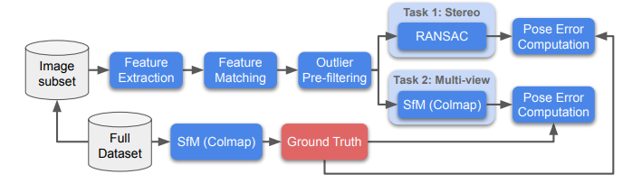

# Image Matching Across Wide Baselines: From Paper to Practice

**标题 & 年份：**2021

**作者：**Yuhe Jin, Dmytro Mishkin

**Journal & doi：**International Journal of Computer Vision volume 129, pages517–547 (2021)

1)Read the title, abstract & introduction. 2) Read the sub-headings. 3) Read the conclusion. 4) Skim the references for familiar ones.

**1st pass (5 min)**

- 类别：Benchmark

- 背景：image-match, SFM

- 正确性：`假设看起来是有效的吗?`

- 贡献：

  - 提出了一种全面的benchmark来评估特征和位姿估计算法，方案聚焦于建图的相机位姿的准确度。（评价指标值得参考）benchmark中包括：
    - 一个关于25个场景的、各几千张图像的数据集，图像来自不同的视角、不同的相机、变化的光照、天气。作者在没有认为干涉的条件下用SFM重建了这些场景，为26k张图像提供了深度图和真值，保留了4k张图像作为测试集；
    - pipeline中组合了许多算法（特征提取、匹配、位姿估计），每一种算法都和进行组合和单独调整；
    - 支持两种下游任务的评估：双视图和多视图重建，评估指标包括针对下游任务的和中间结果；

  - 对多种算法深入研究，论文中进行的实验揭示了一些可以提升SFM性能的特性。
    - 如需要为不同的特征细调ransac参数；
    - 对于不同的任务，最佳的参数是不一样的；
    - 在局部的任务中表现好的参数，也可能在其下游任务中表现不好。

- 框架结构：

  - 介绍benchmark中提供的数据集；

    - 数据集细节；
    - 测试两帧之间的共视关系；
    - 真值的质量；

  - 介绍pipeline：

    

    - 特征提取 -> 特征匹配 -> 外点滤除 -> 双目任务 -> 多视图任务 -> Error metrics;

  - 超参数细节：介绍在验证机上找到合适的超参数的方案，以及说明为什么调参至关重要。`关注`

    - ransac的最大迭代次数、外点阈值、内点率；
    - ratio-test；
    - feature数量；

  - 实现数据整理，挑选出最佳的超参数组合；

  - 还有一些额外的实验；

- 清晰度：暂无法判断

**是否值得继续读：**贡献是我感兴趣的，继续读。

**2nd pass (1 hour)**

这部分的笔记不一定要记在这里，这部分可以按之前我按内容分类记录的文档上。

**3rd pass (4-5 hours)**

- 缺点：
  - 隐藏的假设：
  - 实验和分析上的疑点：
  - 缺失的引用：
- 优点：
  - 结论：
  - 可复用的技术：`表达或实现上的技术`
  - 隐藏的Efficacy：`作者没有提及，但是对我有利的点`

