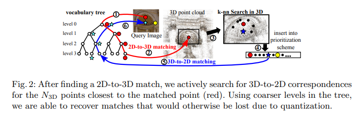
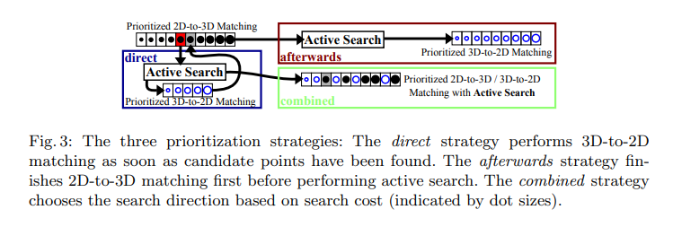

# Improving Image-Based Localization by Active Correspondence Search

**标题 & 年份：**

**作者：**

**Journal & doi：**

1)Read the title, abstract & introduction. 2) Read the sub-headings. 3) Read the conclusion. 4) Skim the references for familiar ones.

**1st pass (5 min)**

- 类别：`这是什么类型的论文?测量的论文吗?对现有系统的分析?研究原型的描述?`
- 背景：`它与其他哪些论文有关? 用哪些理论基础来分析这个问题?`
- 正确性：`假设看起来是有效的吗?`
- 贡献：`论文的主要贡献是什么?`
- 框架结构：
- 清晰度：`论文写得好吗?`

**是否值得继续读：**

**2nd pass (1 hour)**

-  The Image-Based Localization Problem

  目标：提高重定位时的匹配效率，同时找到足够的高质量的匹配策略；

  

  - 2D-to-3D vs. 3D-to-2D Search
    - 2D-to-3D：代表外观信息，质量高，但是当描述子空间稠密，容易拒绝正确匹配；
    - 3D-to-2D：代表共视信息，效率高，描述子空间稀疏，减少正确匹配的拒绝，但可靠性下降，且如何找到合适的3D点？

  

  - Prioritized Search

    目标：优先找更可能产生匹配的点，然后在找到足够的匹配后就停止；

    - 把特征点和visual words关联，word对应的points数和找最近邻的计算成本正相关，计算成本低的优先级高；（直觉上，是偏爱区分度更高的点）

- Active Correspondence Search

  - 查询帧的所有特征会先和码本关联，但是码本相当于一种量化，会限制部分正确的匹配被找到，所以使用软性的机制，一个特征会选择对应的多个words；

  - 一旦找到一个2D-3D匹配（通过比率测试，就算是找到），我们认为在这个3D点附近的3D点被看到的概率更高，我们选择在位置上和这个点最相近的N个点；

  - N个3D点通过码本找3D-2D匹配，还是按匹配得分排序；

    - 2D-3D匹配要使用更细的码本，来限制搜索空间，而3D-2D要是用粗的码本，来保证足够多的特征点被考虑；
    - 分层的词汇树来完成这个工作，可以保证没有额外的开销；
    - AS只会被2D-3D匹配触发，不会被3D-2D匹配触发；

  - 优先级策略：其实是考虑外观信息和共视信息，更侧重哪个？

    - 直接法：将触发的3D -2D 匹配直接排在下一个feature前，这回导致，找到的匹配集在图像的局部区域，对于位姿估计，会产生不稳定的配置，导致定位精度的下降；
    - 排后法：将触发的3D -2D 匹配排在最后，这种方法从AS得到的收益很小，几乎等于直接2D-3D搜索；
    - 结合法：将触发的3D -2D 匹配按匹配得分插入之前的优先级序列；

  - Comparison with Existing Methods

    - 和之前的2D-3D方案相比，AS可以恢复由于码本量化，丢失的匹配；

    - 和3D-2D方案相比，我们的方案可靠性更高；

    - 且AS在效率上最高，同时还结合两种方案的优点；

      

**3rd pass (4-5 hours)**

- 缺点：
  - 隐藏的假设：
  - 实验和分析上的疑点：
  - 缺失的引用：
- 优点：
  - 结论：
  - 可复用的技术：`表达或实现上的技术`
  - 隐藏的Efficacy：`作者没有提及，但是对我有利的点`

