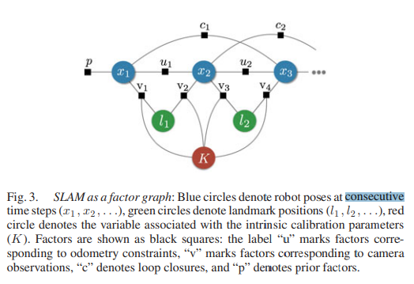

# Past, Present, and Future of Simultaneous Localization and Mapping: Toward the Robust-Perception Age

**标题 & 年份：**2016

**作者：**Cesar Cadena; Luca Carlone; Henry Carrillo; Yasir Latif; Davide Scaramuzza

**Journal & doi：**IEEE Transactions on Robotics

1)Read the title, abstract & introduction. 2) Read the sub-headings. 3) Read the conclusion. 4) Skim the references for familiar ones.

**1st pass (5 min)**

- 类别：Survey
- 背景：
- 贡献：对2016年以前的SLAM的综述。
- 框架结构：
  - 介绍标准的SLAM框架；
  - SLAM的鲁棒性；
  - 可观性问题；
  - 环境的几何表示；
  - 扩展环境表示问题，构建语义信息表示模型；
  - SLAM理论方面目前的成果；
  - 回顾主动SLAM问题，以及如何做决策以提高SLAM系统的性能；
  - SLAM的最新趋势；

- 清晰度：`论文写得好吗?`

**是否值得继续读：**

**2nd pass (1 hour)**

- 介绍：

  - SLAM是同时估计搭载了传感器的机器人的状态（位姿、速度、传感器bias、标定内参）和建图（传感器对环境的感知）的算法；

  - 建图的作用：

    - 支持路径规划和可视化等下游任务；
    - 找回环；

  - SLAM 专家必须处理从传感器校准到系统集成的实际问题；

  - 目前很多里程计已经很准了，SLAM还有必要吗？

    - VIN等视觉-惯性里程计，也可以看做是砍掉回环的SLAM，通常SLAM关注在更有挑战的条件下多传感器融合；

    - 使用里程计是假设机器人在无限长廊里运动，但是SLAM的回环可以提醒机器人回到之前来过的地方；

      - 通过闭环，机器人了解环境的真实拓扑；

      > 为什么丢掉特征信息，直接进行场景识别呢？
      >
      > 因为特征信息使场景识别更简单、鲁棒，特征重建使得机器人可以丢弃无效的回环；

    - 对于需要建一个全局一致的图的应用，必须用到SLAM；

  - SLAM的作用很难评价，因为必须指定 机器人 / 环境 / 性能的组合，才能评价；

    - 机器人：运动类型（如：最大速度），可用的传感器、计算资源；
    - 环境：平面 / 3D？存在自然 / 人工路标？动态元素的数量，对称结构的数量，感知混淆的风险（依赖于传感器和环境的组合）；
    - 性能要求：期望的状态估计精度、准确度、map的类型（稀疏 / 稠密）、成功率（满足精度的百分比）、状态估计的延时、最大运行时间、最大地图面积；

  - SLAM的未来：

    - 鲁棒性能：实现在任意环境长时间以低失败率运行，系统具有失效保护机制，且具有自动调整功能，可以根据应用场景自动选择系统参数；
    - 更高的理解能力：除了基本的几何重建，还能够在更高层次上理解环境，如：语义、更高层次的几何……）
    - 资源敏感：SLAM系统可以根据资源和传感器裁剪，并根据现有资源调整计算负载；
    - 判断驱动任务：根据支持的任务选择相关的感知信息、过滤不相关的传感器数据，根据任务调整地图表示的复杂度；

  > 作者建议先看SLAM 12，那就先看吧。`回来了，弃了12`

- SLAM的标准框架：

  包括两个主要组件：前端和后端， 前端将传感器数据抽象成适合估计的模型，而后端则对前端产生的抽象数据进行推理；
  
  - 最大后验估计和SLAM后端：
  
    - 问题建模：
  
      - 观测方程：$z_{k}=h_{k}\left(\mathcal{X}_{k}\right)+\epsilon_{k}$
      - 目标方程：$\mathcal{X}^{\star} \doteq \underset{\mathcal{X}}{\operatorname{argmax}} \mathrm{p}(\mathcal{X} \mid Z)=\underset{\mathcal{X}}{\operatorname{argmax}} \mathrm{p}(Z \mid \mathcal{X}) \mathrm{p}(\mathcal{X})$
  
      注：在不知道先验时，先验是一个常量，也就是均匀分布；
  
      - 和卡尔曼滤波不同的是，MAP估计不要求明确的区分运动方程和观测方程；
      - 如果观测是独立的，目标方程可以分解为：$\begin{aligned} \mathcal{X}^{\star} &=\underset{\mathcal{X}}{\operatorname{argmax}} \mathrm{p}(\mathcal{X}) \prod_{k=1}^{m} \mathrm{p}\left(z_{k} \mid \mathcal{X}\right) \\ &=\underset{\mathcal{X}}{\operatorname{argmax}} \mathrm{p}(\mathcal{X}) \prod_{k=1}^{m} \mathrm{p}\left(z_{k} \mid \mathcal{X}_{k}\right) \end{aligned}$
      - 因子图表示：
  
      
  
      - 目标方程代入观测方程，假设噪声是高斯白噪声：
  
        $\mathrm{p}\left(z_{k} \mid \mathcal{X}_{k}\right) \propto \exp \left(-\frac{1}{2}\left\|h_{k}\left(\mathcal{X}_{k}\right)-z_{k}\right\|_{\Omega_{k}}^{2}\right)$
  
        先验：$\mathrm{p}(\mathcal{X}) \propto \exp \left(-\frac{1}{2}\left\|h_{0}(\mathcal{X})-z_{0}\right\|_{\Omega_{0}}^{2}\right)$
  
      - 最大后验转最小化负对数：
  
        $\begin{aligned} \mathcal{X}^{\star} &=\underset{\mathcal{X}}{\operatorname{argmin}}-\log \left(\mathrm{p}(\mathcal{X}) \prod_{k=1}^{m} \mathrm{p}\left(z_{k} \mid \mathcal{X}_{k}\right)\right) \\ &=\underset{\mathcal{X}}{\operatorname{argmin}} \sum_{k=0}^{m}\left\|h_{k}\left(\mathcal{X}_{k}\right)-z_{k}\right\|_{\Omega_{k}}^{2} \end{aligned}$
  
        转化成了非线性最小二乘问题，目前这个结果由对噪声的假设是高斯白噪声导出的，如果对噪声有别的假设，那成本函数的形式就不同了；
  
        - 如噪声服从拉普拉斯分布，那squared l2 -norm变l1 -norm；
        - 为了增加对外点的容忍度，也会把squared l2 -norm替换为更鲁棒的loss function，如Huber或Tukey等；
  
    - CV这边类似的问题是SFM里的BA问题，但是有两个关键区别：
  
      - SLAM这边因子不仅是对射影几何建模，还包括多种传感器；
      - SLAM这边更要求增量式的解；
  
    - 非线性优化：
  
    - 
  
      

**3rd pass (4-5 hours)**

- 缺点：
  - 隐藏的假设：
  - 实验和分析上的疑点：
  - 缺失的引用：
- 优点：
  - 结论：
  - 可复用的技术：`表达或实现上的技术`
  - 隐藏的Efficacy：`作者没有提及，但是对我有利的点`

**参考文献**

- [SLAM](https://www.cs.columbia.edu/~allen/F19/NOTES/slam_paper.pdf)

- 概率机器人 书（买一本吧）
- [A review of recent developments in simultaneous localization and mapping](https://ieeexplore.ieee.org/stamp/stamp.jsp?arnumber=6038117)

- [Visual place recognition: A survey](https://eprints.qut.edu.au/222264/1/visual_place_recognition_a_survey_revised_final.pdf)
- [Simultaneous Localisation and Mapping (SLAM): Part II State of the Art](http://robotics.caltech.edu/~jwb/courses/ME132/final/slamtute2.pdf)
- [Simultaneous Localization and Mapping: Part I](http://everobotics.org/pdf/SLAMTutorial.pdf) `弃了`

[143] F. R. Kschischang, B. J. Frey, and H. A. Loeliger, “Factor graphs and the sum-product algorithm,” IEEE Trans. Infor. Theory, vol. 47, no. 2, pp. 498–519, Feb. 2001.
