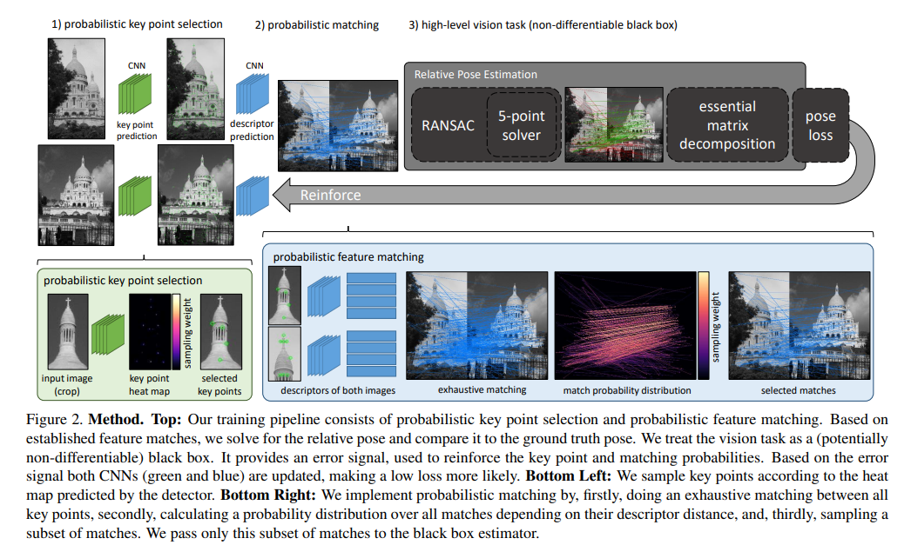

# Reinforced Feature Points: Optimizing Feature Detection and Description for a High-Level Task

**标题 & 年份：**2020

**作者：**Aritra Bhowmik, Stefan Gumhold, Carsten Rother, Eric Brachmann

**Journal & doi：**CVPR

1)Read the title, abstract & introduction. 2) Read the sub-headings. 3) Read the conclusion. 4) Skim the references for familiar ones.

**1st pass (5 min)**

- 类别：Feature & Descriptors 

- 背景：最新的一些提取特征和描述子的学习方法，都是在匹配得分上优化的，通常是预定义一组patch对，已知匹配或不匹配，或是否包含key points，然后进行训练。但是在这种匹配得分上精度的提升，不一定能转换成高阶的视觉任务的性能提升。

  - HPatches定义了一组图像匹配patches；
  - 如superpoint在匹配得分上优于SIFT，但是在估计基础矩阵的任务上，不如SIFT；`有实验吗？`
  - 如LIFT的匹配得分高于SIFT，但是没有获得比SIFT更好的重建效果；`comparative...论文里的实验结论`
  - GeoDesc / R2D2 /SIPs等都做出了改进，设计了一种模仿高层视觉任务的训练方法；`不懂`

- 正确性：

- 贡献：

  - 提出一种新的训练方案，把特征提取嵌入到完整的视觉pipeline 中；
    - 使用强化学习的原理克服了关键点选择器和描述符匹配的离散性；
    - 可以解决相对位姿估计，重定位，SFM，SLAM等问题；
    - pipeline包括了关键点提取、描述子匹配和鲁棒的模型拟合；
    - 训练不需要预定义真值匹配对和困难样本挖掘；

  - 将训练方案使用在superpoint上，使superpoint到达并略微超过在基础矩阵估计任务上的准确度；

- 框架结构：

  - 介绍；

  - 方法：

    

    - 概率关键点选择；
    - 概率特征匹配；
    - 学习目标；

  - 实验：

    - 相对位姿估计实验；
    - 低层次的匹配精度；
    - SFM；

  - 结论：

    - 本文提出了一种端到端训练特征提取和描述子生成的算法，在相对位姿估计任务上，算法通过移除可靠性低的关键点和细化保留的关键点的位置，提升位姿估计精度；
    - 算法要求网络被良好的初始化，这可能会限制训练的性能；
    - 网络几乎不能发现新的关键点，初始概率低的位置的关键点将不会被选择，未来会改进这一点；

- 清晰度：`论文写得好吗?`

**是否值得继续读：**暂时不打算深入了解，结论上看，没有明显的提升；

**2nd pass (1 hour)**

这部分的笔记不一定要记在这里，这部分可以按之前我按内容分类记录的文档上。

**3rd pass (4-5 hours)**

- 缺点：
  - 隐藏的假设：
  - 实验和分析上的疑点：
  - 缺失的引用：
- 优点：
  - 结论：
  - 可复用的技术：`表达或实现上的技术`
  - 隐藏的Efficacy：`作者没有提及，但是对我有利的点`

**参考文献**

[54] D. P. Vassileios Balntas, Edgar Riba and K. Mikolajczyk. Learning local feature descriptors with triplets and shallow convolutional neural networks. In BMVC, 2016.

[48] R. S. Sutton and A. G. Barto. Introduction to Reinforcement Learning. MIT Press, 1998.