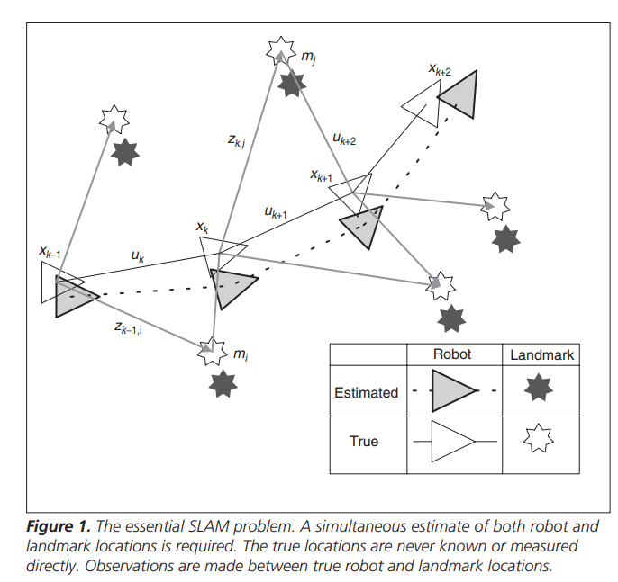

# Simultaneous Localization and Mapping: Part I
**标题 & 年份：**H. Durrant-Whyte; T. Bailey

**作者：**2006

**Journal & doi：**IEEE Robotics & Automation Magazine

1)Read the title, abstract & introduction. 2) Read the sub-headings. 3) Read the conclusion. 4) Skim the references for familiar ones.

**1st pass (5 min)**

- 类别：算是 教程
- 背景：
- 贡献：
- 框架结构：
  - SLAM问题的公式和结构；
  - 概率SLAM；
  - 概率SLAM的结构；
  - SLAM问题的解决方案；
  - EKF-SLAM；
    - 收敛性；
    - 计算代价；
    - 数据关联；
    - 非线性；

  - Rao-Blackwellized Filter；
  - SLAM的实现；

- 清晰度：定义了SLAM问题，但是有点难看懂；

**是否值得继续读：**`看到中途弃了，时间比较紧，还是打算看更接近现代SLAM的教程`

**2nd pass (1 hour)**

- SLAM问题的公式和结构：
  - SLAM就是移动机器人在环境中建一个图，同时用这个图定位自己；
    - SLAM问题模型：$P\left(\mathbf{x}_{k}, \mathbf{m} \mid \mathbf{Z}_{0: k}, \mathbf{U}_{0: k}, \mathbf{x}_{0}\right)$，随时间递归；
    
    - 观测模型：$P\left(\mathbf{z}_{k} \mid \mathbf{x}_{k}, \mathbf{m}\right)$
    
    - 运动模型：$P\left(\mathbf{x}_{k} \mid \mathbf{x}_{k-1}, \mathbf{u}_{k}\right)$
    
    - 时间更新：$P\left(\mathbf{x}_{k}, \mathbf{m} \mid \mathbf{Z}_{0: k-1}, \mathbf{U}_{0: k}, \mathbf{x}_{0}\right)=\int P\left(\mathbf{x}_{k} \mid \mathbf{x}_{k-1}, \mathbf{u}_{k}\right)$
      $\quad \times P\left(\mathbf{x}_{k-1}, \mathbf{m} \mid \mathbf{Z}_{0: k-1}, \mathbf{U}_{0: k-1}, \mathbf{x}_{0}\right) \mathrm{d} \mathbf{x}_{k-1}$
      
    - 观测更新：
    
      $P\left(\mathbf{x}_{k}, \mathbf{m} \mid \mathbf{Z}_{0: k}, \mathbf{U}_{0: k}, \mathbf{x}_{0}\right)=\frac{P\left(\mathbf{z}_{k} \mid \mathbf{x}_{k}, \mathbf{m}\right) P\left(\mathbf{x}_{k}, \mathbf{m} \mid \mathbf{Z}_{0: k-1}, \mathbf{U}_{0: k}, \mathbf{x}_{0}\right)}{P\left(\mathbf{z}_{k} \mid \mathbf{Z}_{0: k-1}, \mathbf{U}_{0: k}\right)}$

参考图 1，可以看出估计和真实地标位置之间的大部分误差在地标之间是常见的，并且误差来源单一； 这意味着任何两个地标之间的相对位置 mi - mj 可以以高精度知道，即使地标 mi 的绝对位置非常不确定。 在概率形式中，这意味着即使边缘密度 P(mi) 可能非常分散，这对地标 P(mi, mj) 的联合概率密度也是高度峰值。

SLAM 中最重要的见解是意识到，随着越来越多的观察，地标估计之间的相关性单调增加。 这意味着地标的相对位置的知识总是会改进并且永远不会发散，无论机器人如何运动。 用概率术语来说，这意味着所有地标 P(m) 上的联合概率密度随着观察次数的增加而单调增加。

**3rd pass (4-5 hours)**

- 缺点：
  - 隐藏的假设：
  - 实验和分析上的疑点：
  - 缺失的引用：
- 优点：
  - 结论：
  - 可复用的技术：`表达或实现上的技术`
  - 隐藏的Efficacy：`作者没有提及，但是对我有利的点`

