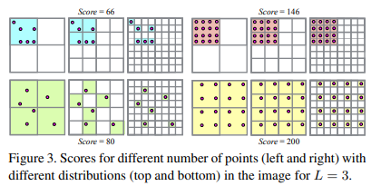
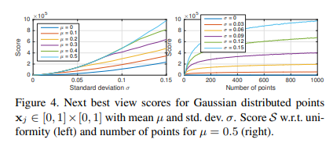
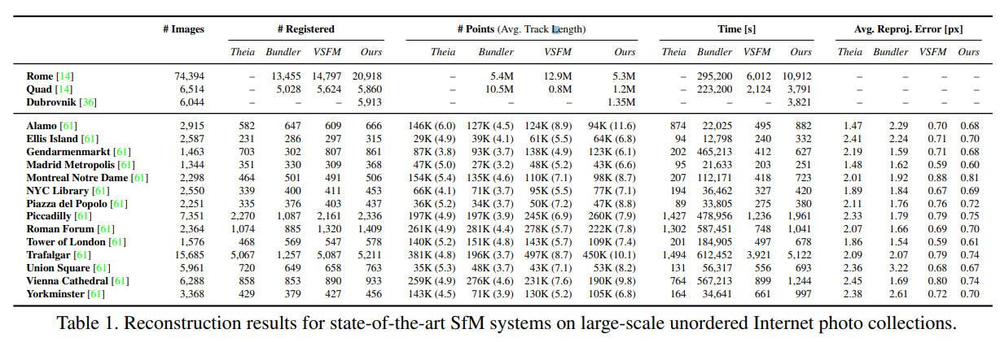
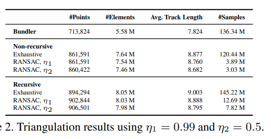

# Structure-from-Motion Revisited

**标题 & 年份：**2016

**作者：**Johannes L. Schonberger, Jan-Michael Frahm

**Journal & doi：**Proceedings of the IEEE Conference on Computer Vision and Pattern Recognition (CVPR), 2016, pp. 4104-4113

1)Read the title, abstract & introduction. 2) Read the sub-headings. 3) Read the conclusion. 4) Skim the references for familiar ones.

**1st pass (5 min)**

- 类别：对增量式SFM框架和理论的阐述；
- 背景：SFM
- 正确性：时间证明了有效。
- 贡献：一个建图鲁棒、完整、准确、可扩展的SFM pipeline。
- 框架结构：
  - 回顾SFM：
    - 匹配搜索；
      - 特征提取；
      - 特征匹配；
      - 几何验证；

    - 增量式建图；
      - 初始化；
      - 图像注册；
      - 三角化；
      - BA；

  - 存在的挑战；
  - 论文所述工作的贡献；
    - 场景图增强；
    - 下一个最佳视图的选择；
    - 鲁棒且有效的三角化：场景结构更完整、计算复杂度更小；
    - BA；
      - 参数化；
      - 过滤；
      - 重新三角化；
      - 迭代的细化；

    - 冗余视图挖掘；

  - 实验：对工作的贡献，逐个测评；

- 清晰度：好

**是否值得继续读：**对SFM的回顾和论文的贡献可以作为我了解SFM的开始；

**2nd pass (1 hour)**

- Review of Structure-from-Motion

  - Correspondence Search

    输入：N张图像；

    输出：完成几何验证的图像对，和每个3D在图像上投影的graph；

    - 特征提取；

    - 匹配：输出一组可能overlap的图像对，和它们的特征匹配；

      -- 每个图像遍历所有图像，每个特征遍历对应图像的所有特征，时间复杂度是$O\left(N_{I}^{2} N_{F_{i}}^{2}\right)$，大部分工作都把这个环节做成可扩展的了；

    - 几何验证：

      -- 单应矩阵描述了纯旋转，或移动的相机拍摄到平面；

      -- 设计了`运动模型选择的标准`；（目前被我改成了只使用E，但还是有必要了解设计的原因，和适用的条件）

      -- 输出是场景图，图像是Node，通过验证的图像对是边；

  - 增量式建图

    输入：场景图；

    输出：注册的图像的位姿，重建的场景结构（3D点）；

    - 初始化：选择合适的初始化图像对至关重要；

      -- 重场景图中稠密的位置初始化（边最多的node），建图会更鲁棒和准确；

      -- 相对的，从稀疏的位置初始化，可以减少运行时间；

    - 图像注册：新的图像注册到当前的模型：使用图像上的2D点和已三角化的3D点对，`解PnP问题`，得到图像的位姿，对于没有标定的相机，还会求解内参；

      -- 下一个注册图像的选择；

    - 三角化：利用新注册的图像，注册新的3D点；

      -- 提出了一种鲁棒的三角化方法；

      -- 有大量的多视图三角化方案存在；

    - ==BA==：前面图像注册和3D点注册是分开的，不确定性从图像传递到3D点，反之亦然，如果不做全局的调整（类似回环吗？），SFM会漂掉，BA联合非线性优化相机参数（位姿、内参）和点，最小化重投影误差：$E=\sum_{j} \rho_{j}\left(\left\|\pi\left(\mathbf{P}_{c}, \mathbf{X}_{k}\right)-\mathbf{x}_{j}\right\|_{2}^{2}\right)$；

      -- 特殊的参数结构，使得可以使用`舒尔补`技巧；`看MVG上关于BA的部分`

      -- 提出了一种定义和参数化高度重叠的图像的方案，在密集的图像集上高效的BA；

- 挑战

  - 目前的SFM算法在完整性和鲁棒性上经常跪；
    - 匹配找的不够；
    - 缺失 / 不正确的场景结构：图像注册和三角化是共生关系，图像只能注册到已有的场景结构（3D点），而场景结构只能由已经注册的图像三角化出来；

- 贡献

  - 场景图增强

    多模型几何验证策略（目前被我关了……）；`Water Mark？`

    -- 后续喂给重建的种子来自non-panoramic和已标定的；

    -- 后续将不三角化纯旋转的点，避免退化的点；`应该仅关掉F的估计`

  - 下一个最佳视图的选择：

    - 选择至少已经有$N_t$个点被三角化的图像：

      -- 维护一个特征点track图：对于网络数据集而言，这个图会非常的稠密，因为许多图像都看到了相似的结构；

    - 同时维护每个候选图像上可视的点的数量和分布；

      

      多分辨率计分，各层权重等于$K_l=2^l,w_l=K^2_l$,分布越不均匀，得分越高；

  - 鲁棒和高效的三角化

    :star: 利用传递对应关系提升三角化的完整性和准确度，匹配的技术限制了找到的匹配图像对是外观相似的，所以双视图对应的结果经常受限于窄基线。利用传递关系可以建立更宽基线的匹配，从而使三角化更加准确；

    - 提出了一种基于采样的三角化方法，可以在有外点污染track的情况下，鲁棒的估计所有的点；`作者统计过外点率多高的都有`

      -- 经过几何验证外点依然很多，建明希望SuperGlue实现的是减少匹配这个阶段的误匹配；

    - Bundler的做法：对track里的元素成对采样，计算双视图三角化，如果其中有至少一个算出了合理的三角化角度，就在整条track上做多视图三角化，然后如果track里所有的特征点都符合cheirality constraint，这个3D就通过了；

      注：一条track对应的就是一个3D点；

      - 这个方案对外点还是不够鲁棒；
    - 它不能恢复被错误的merge到一条track里的多个点；
      - 计算成本高：对track详尽的成对采样；
    
    - 配合RANSAC来做三角化，最小的配置双视图就是三角化的最小配置：$\mathbf{X}_{a b} \sim \tau\left(\overline{\mathbf{x}}_{a}, \overline{\mathbf{x}}_{b}, \mathbf{P}_{a}, \mathbf{P}_{b}\right)$ with $a \neq b$

      - where τ is any chosen triangulation method (in our case the DLT method).
    - :star: 因为一个track里包含多个独立的点，在筛出一个点后，还会对剩余的特征递归的进行ransac三角化3D点的过程，如果最新的consensus set的大小小于3了，就停止递归。
    
  - BA

    为了缓解累积的误差，在完成一帧的图像注册和三角化后，会进行BA。通常没有必要进行全局的BA，因为增量式的SFM只影响模型的局部。因此，会在每一帧注册后对与这一帧most-connected的图像local BA。

    - 参数化：local BA使用Cauchy function作为损失函数，对网络上的图像数据，仅使用有一个径向畸变参数的相机模型，模型参数估计纯粹依赖自标定（似乎是指建图时，一起优化）；

    - Filter：

      - 过滤重投影误差较大的点；

      ==注：==这个流程和标定好像哦；

      - 对每个地图点要满足最小的三角化夹角；
    - global BA之后也会过滤退化的cameras，如：仅有旋转的的图，这些相机可能只有outlier观测（视角异常），或者它们的内参收敛到一个虚假的最小值（畸变系数的幅度过大）；
  
      ==注：==提到主点的标定是一个不适定问题；

    - Re-Triangulation：

      - 在global-BA 前会重新三角化；
    - 在BA后也会在做一次三角化（因为BA应该是改善了位姿和点的），post-BA 会使用之前三角化失败的tracks（可能是因为之前位姿不准，三角化失败），不过在这一步提高了三角化阈值，而且只continue观测的误差小于filter阈值的tracks；
      - 此外，在Re-Triangulation的环节，还会merge tracks。
  
      :triangular_flag_on_post: 这部分不太明白，需要对照代码实现；

    - 迭代优化：因为漂移或pre-BA RT，通常BA后，大部分观测点是异常值，随后被filter，由于这一步BA受到异常值严重影响，再进行一步BA可以改善结果；

      BA、RT、filtering迭代执行，直到滤除对观测和RT点较少；

  - Redundant View Mining `暂留，看参考论文`

    将场景高度重叠的相机聚类到一个组里；:triangular_flag_on_post: 这部分不太明白，需要看参考的论文；

- 实验

  - Next Best View Selection.

    

  - Robust and Efficient Triangulation

    

    目前对各个算法的三角化实现不是太清楚，从表格数据上看，colmap和VSFM表现相近，甚至VSFM的数据更好，但是VSFM的注册图像数量不如colmap；

    

    基于ransac的方法，和详尽采样的方法相比，track略短，但是速度会快很多（10-40倍），而且可以通过调节参数，来平衡运行速度和完整性。

  - Redundant View Mining

    :triangular_flag_on_post: 对原理不太明白，所以对实验也不是很明白，需要迭代；

  - System

    Theia is the fastest method, while our method achieves slightly worse timings than VisualSFM and is more than 50 times faster than Bundler.

    For all datasets, we significantly outperform any other method in terms of completeness, especially for the larger models. Importantly, the increased track lengths result in higher redundancy in BA.

**3rd pass (4-5 hours)**

- 缺点：
  - 隐藏的假设：
  - 实验和分析上的疑点：
  - 缺失的引用：
- 优点：
  - 结论：
  - 可复用的技术：`表达或实现上的技术`
  - 隐藏的Efficacy：`作者没有提及，但是对我有利的点`

**参考论文**

[30] J. Heinly, J. L. Schonberger, E. Dunn, and J.-M. Frahm. Re- ¨ constructing the World* in Six Days *(As Captured by the Yahoo 100 Million Image Dataset). CVPR, 2015. 1, 2, 3

**增量式建图**

[53] N. Snavely, S. Seitz, and R. Szeliski. Photo tourism: exploring photo collections in 3d. ACM TOG, 2006. 1, 4, 5, 6

 [1] S. Agarwal, Y. Furukawa, N. Snavely, I. Simon, B. Curless, S. Seitz, and R. Szeliski. Building rome in a day. ICCV, 2009. 1, 2

[20] J.-M. Frahm, P. Fite-Georgel, D. Gallup, T. Johnson, R. Raguram, C. Wu, Y.-H. Jen, E. Dunn, B. Clipp, S. Lazebnik, and M. Pollefeys. Building Rome on a Cloudless Day. ECCV, 2010. 1, 2, 3

[62] C. Wu. Towards linear-time incremental structure from motion. 3DV, 2013. 1, 2, 3, 5, 6, 7

**分层建图**

[23] R. Gherardi, M. Farenzena, and A. Fusiello. Improving the efficiency of hierarchical structure-and-motion. CVPR, 2010. 1

**全局建图**

[14] D. Crandall, A. Owens, N. Snavely, and D. P. Huttenlocher. Discrete-Continuous Optimization for Large-Scale Structure from Motion. CVPR, 2011. 1, 7, 8

[61] K. Wilson and N. Snavely. Robust global translations with 1dsfm. ECCV, 2014. 1, 8

[56] C. Sweeney, T. Sattler, T. Hollerer, M. Turk, and M. Pollefeys. Optimizing the viewing graph for structure-frommotion. CVPR, 2015. 1

**几何验证**

[57] P. H. Torr. An assessment of information criteria for motion model selection. CVPR, 1997. 2

**图像注册**

[34] V. Lepetit, F. Moreno-Noguer, and P. Fua. EPnP: An accurate O(n) solution to the PnP problem. IJCV, 2009. 2, 4

[31] A. Irschara, C. Zach, J.-M. Frahm, and H. Bischof. From structure-from-motion point clouds to fast location recognition. CVPR, 2009. 2, 4

**三角化**

[32] L. Kang, L. Wu, and Y.-H. Yang. Robust multi-view l2 triangulation via optimal inlier selection and 3d structure refinement. Pattern Recognition, 2014. 2, 4, 5

**BA**

[13] Y. Chen, T. A. Davis, W. W. Hager, and S. Rajamanickam. Algorithm 887: Cholmod, supernodal sparse cholesky factorization and update/downdate. ACM TOMS, 2008. 3

[38] M. I. Lourakis and A. A. Argyros. SBA: A software package for generic sparse bundle adjustment. ACM TOMS, 2009. 3

[63] C. Wu, S. Agarwal, B. Curless, and S. Seitz. Multicore bundle adjustment. CVPR, 2011. 3

:star: [4] S. Agarwal, N. Snavely, S. Seitz, and R. Szeliski. Bundle adjustment in the large. ECCV, 2010. 3

:star: [54] N. Snavely, S. Seitz, and R. Szeliski. Skeletal graphs for efficient structure from motion. CVPR, 2008. 2, 3

[43] K. Ni, D. Steedly, and F. Dellaert. Out-of-core bundle adjustment for large-scale 3d reconstruction. ICCV, 2007. 6

[11] L. Carlone, P. Fernandez Alcantarilla, H.-P. Chiu, Z. Kira, and F. Dellaert. Mining structure fragments for smart bundle adjustment. BMVC, 2014. 6

**缺失结构**

[64] E. Zheng and C. Wu. Structure from motion using structureless resection. ICCV, 2015. 3

**WaterMark**

[60] T. Weyand, C.-Y. Tsai, and B. Leibe. Fixing wtfs: Detecting image matches caused by watermarks, timestamps, and frames in internet photos. WACV, 2015. 3

[30] J. Heinly, J. L. Schonberger, E. Dunn, and J.-M. Frahm. Re- ¨ constructing the World* in Six Days *(As Captured by the Yahoo 100 Million Image Dataset). CVPR, 2015. 1, 2, 3

**标定**

[15] L. de Agapito, E. Hayman, and I. Reid. Self-calibration of a rotating camera with varying intrinsic parameters. BMVC, 1998. 6

