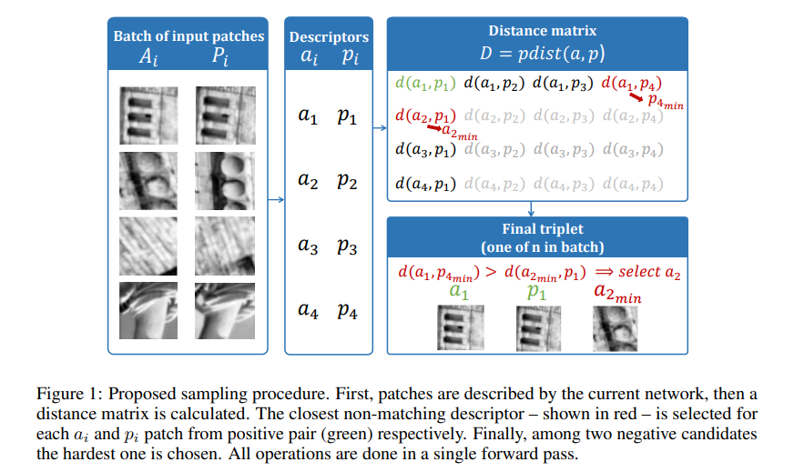

# Working hard to know your neighbor’s margins: Local descriptor learning loss

**标题 & 年份：**2018

**作者：**Anastasiya Mishchuk, Dmytro Mishkin, Filip Radenovic, Jiri Matas

**Journal & doi：**NIPS

1)Read the title, abstract & introduction. 2) Read the sub-headings. 3) Read the conclusion. 4) Skim the references for familiar ones.

**1st pass (5 min)**

- 类别：DeepLearning Algo
- 背景：目前描述子有手工设计的SIFT等，或者学习的LIFT，MatchNet等，目前学习的描述子虽然在patch verification等任务上表现好，但是在图像匹配、3D重建等任务上，还不如改进版的SIFT；【Comparative evaluation of hand-crafted and learned local features】里提到因为目前local patches数据集还不够大，还不够多样化以允许学习高质量的广泛适用的描述符；
- 正确性：
- 贡献：提出了一种新的loss，也可以说是一种新的学习描述子，在图像识别、极端条件下的双视图匹配上表现的更好；
- 框架结构：
  - The proposed descriptor
    - Sampling and loss
    - Model architecture
    - Exploring the batch size influence
  -  Empirical evaluation
    - Patch descriptor evaluation
    - Ablation study
    - Wide baseline stereo
    - Image retrieval
  -  Conclusions
- 清晰度：`论文写得好吗?`

**是否值得继续读：**

**2nd pass (1 hour)**

triplet margin loss: $L=\frac{1}{n} \sum_{i=1, n} \max \left(0,1+d\left(a_{i}, p_{i}\right)-\min \left(d\left(a_{i}, p_{j_{\min }}\right), d\left(a_{k_{\min }}, p_{i}\right)\right)\right)$

**3rd pass (4-5 hours)**

- 缺点：
  - 隐藏的假设：
  - 实验和分析上的疑点：
  - 缺失的引用：
- 优点：
  - 结论：
  - 可复用的技术：`表达或实现上的技术`
  - 隐藏的Efficacy：`作者没有提及，但是对我有利的点`

