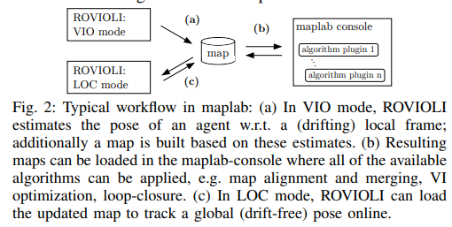
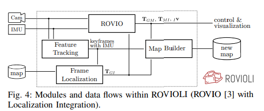
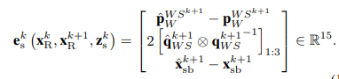

# maplab: An Open Framework for Research in Visual-inertial Mapping and Localization

**标题 & 年份：**

**作者：**Thomas Schneider∗†, Marcin Dymczyk∗†, Marius Fehr∗†

**Journal & doi：**

1)Read the title, abstract & introduction. 2) Read the sub-headings. 3) Read the conclusion. 4) Skim the references for familiar ones.

**1st pass (5 min)**

- 类别：`这是什么类型的论文?测量的论文吗?对现有系统的分析?研究原型的描述?`
- 背景：目前的SLAM框架：
  - 大多聚焦于单个session，或者仅提供大尺度的批量优化，而没有在线前端；
  - 它们通常是为某个特定的任务设计的地图结构和pipeline；
  - 没有提供完整的workflow：地图被创建、操作、merge、在前端被重用；

- 正确性：`假设看起来是有效的吗?`
- 贡献：
  - 介绍了一个通用的视觉-惯性建图框架；
  - 介绍了ROVIOLI，一个鲁棒的视觉惯性-重定位里程计；
  - maplab提供：
    - 创建地图，基于地图定位；
    - 地图多个session merge、稀疏化、loop closure（场景识别和定位）、稠密重建、可视化；

  - 框架结构：
    - THE MAPLAB FRAMEWORK
      - A. Notation
      - B. Workflow for multi-session mapping and localization
      - C. maplab console: the offline user interface
      - D. Map structure
      - E. Core packages of maplab
      - F. ROVIOLI: online VIO and localization frontend

    - USE-CASES
      - A. Online mapping and localization with ROVIOLI
      - B. Multi-session mapping
      - C. Map maintenance
      - D. Large-scale mapping
      - E. Dense reconstruction

    - USING MAPLAB FOR RESEARCH
    - 总结： the framework provides an implementation of the most important tools required in mapping and localization related research such as `visual-inertial optimization`, a `loop-closure/localization` backend, multi-session `map merging`, `pose-graph relaxation` and extensive introspection and visualization tools.

- 清晰度：`论文写得好吗?`

**是否值得继续读：**

**2nd pass (1 hour)**

- maplab framework:

  

  这个论文是面向工程实现的，在框架的开始介绍了框架组织代码的形式，以及依赖的库，并提供了哪些接口（如提供ROS接口处理原始传感器数据），可视化工具；

  - Map structure

    VI-map中包括所有传感器的原始测量和对环境的稀疏重建，结构的核心是vertex / edges / landmarks；

    1. vertex包括某个时刻的状态，包括状态估计（位姿，IMU bias，速度）和视觉信息（特征，描述子，tracking，图像）；
    2. edges连接两个vertex，如IMU边，包括惯性测量；
    3. 视觉观测由landmark串成track，landmark被存在第一个看到它的vertex；

    这个地图结构被存成protobuf的格式，而且可以只取出某一个mission或vertex，降低了峰值内存；

  - Core packages of maplab

    - ROVIOLI: online VIO and localization frontend

      

      

    -  visual-inertial weighted least-squares optimization with cost terms

      $J(\mathbf{x}):=\sum_{i=1}^{I} \sum_{k=1}^{K} \sum_{j \in \mathcal{J}(i, k)} \mathbf{e}_{\mathrm{r}}^{i, j, k^{T}} \mathbf{W}_{\mathrm{r}}^{i, j, k} \mathbf{e}_{\mathrm{r}}^{i, j, k}+\sum_{k=1}^{K-1} \mathbf{e}_{\mathrm{s}}^{k^{T}} \mathbf{W}_{\mathrm{s}}^{k} \mathbf{e}_{\mathrm{s}}^{k}$

      - 重投影误差：$\mathbf{e}_{\mathrm{r}}^{i, j, k}=\mathbf{z}^{i, j, k}-\mathbf{h}_{i}\left(\boldsymbol{T}_{C_{i} S} \boldsymbol{T}_{S W}^{k} l_{W}^{W L, j}\right) .$

      - IMU：

        

        $\mathbf{x}_{\mathrm{R}}:=\left[\mathbf{p}_{W}^{W S^{T}}, \mathbf{q}_{W S}^{T}, \mathbf{v}_{W}^{W S^{T}}, \mathbf{b}_{\mathrm{g}}^{T}, \mathbf{b}_{\mathrm{a}}^{T}\right]^{T} \in \mathbb{R}^{3} \times S^{3} \times \mathbb{R}^{9}$

        $\mathbf{W}_{\mathrm{s}}^{k}=\mathbf{R}_{\mathrm{s}}^{k^{-1}}=\left(\frac{\partial \mathbf{e}_{\mathrm{s}}^{k}}{\partial \delta \hat{\boldsymbol{\chi}}_{\mathrm{R}}^{k+1}} \mathbf{P}\left(\delta \hat{\chi}_{\mathrm{R}}^{k+1} \mid \mathbf{x}_{\mathrm{R}}^{k}, \mathbf{z}_{\mathrm{s}}^{k}\right) \frac{\partial \mathbf{e}_{\mathrm{s}}^{k}}{\partial \delta \hat{\chi}_{\mathrm{R}}^{k+1}}{ }^{T}\right)^{-1}$

        $\mathbf{P}_{\mathrm{R}}^{p+1}=\mathbf{F}_{\mathrm{d}}\left(\hat{\mathbf{x}}_{\mathrm{R}}^{p}, \Delta t\right) \mathbf{P}_{\mathrm{R}}^{p} \mathbf{F}_{\mathrm{d}}\left(\hat{\mathbf{x}}_{\mathrm{R}}^{p}, \Delta t\right)^{T}+\mathbf{G}\left(\hat{\mathbf{x}}_{\mathrm{R}}^{p}\right) \mathbf{Q G}\left(\hat{\mathbf{x}}_{\mathrm{R}}^{p}\right)^{T} \Delta t$

    - Switchable Constraints for Robust Pose Graph SLAM：

      $\begin{aligned} X^{*}, S^{*}=\underset{X, S}{\operatorname{argmin}} & \underbrace{\sum_{i}\left\|f\left(\mathbf{x}_{i}, \mathbf{u}_{i}\right)-\mathbf{x}_{i+1}\right\|_{\Sigma_{i}}^{2}}_{\text {Odometry Constraints }} \\ &+\underbrace{\sum_{i j}\left\|\Psi\left(s_{i j}\right) \cdot\left(f\left(\mathbf{x}_{i}, \mathbf{u}_{i j}\right)-\mathbf{x}_{j}\right)\right\|_{\boldsymbol{\Lambda}_{i j}}^{2}}_{\text {Switchable Loop Closure Constraints }} \\ &+\underbrace{\sum_{i j}\left\|\gamma_{i j}-s_{i j}\right\|_{\Xi_{i j}}^{2}}_{\text {Sontrains }} \end{aligned}$

    - Map sparsification

    - Dense reconstruction

**3rd pass (4-5 hours)**

- 缺点：
  - 隐藏的假设：
  - 实验和分析上的疑点：
  - 缺失的引用：
- 优点：
  - 结论：
  - 可复用的技术：`表达或实现上的技术`
  - 隐藏的Efficacy：`作者没有提及，但是对我有利的点`

**参考文献**

[1] S. Leutenegger, S. Lynen, M. Bosse, R. Siegwart, and P. Furgale, “Keyframe-based visual–inertial odometry using nonlinear optimization,” IJRR, 2015.

[3] P. T. Furgale. Extensions to the Visual Odometry Pipeline for the Exploration of Planetary Surfaces. PhD thesis, University of Toronto, 2011.

[37] N. Sunderhauf and P. Protzel, “Switchable constraints for ¨ robust pose graph SLAM,” in IROS, 2012.

[10] M. Dymczyk, S. Lynen, T. Cieslewski, M. Bosse, R. Siegwart, and P. Furgale, “The gist of maps-summarizing experience for lifelong localization,” in ICRA, 2015.

[11] M. Dymczyk, S. Lynen, M. Bosse, and R. Siegwart, “Keep it brief: Scalable creation of compressed localization maps,” in IROS, 2015.

[38] H. Oleynikova, Z. Taylor, M. Fehr, R. Siegwart, and J. Nieto, “Voxblox: Incremental 3d euclidean signed distance fields for on-board MAV planning,” arXiv:1611.03631, 2016.

Robust Visual Inertial Odometry Using a Direct EKF-Based Approach

Map Summarization for Tractable Lifelong Mapping

Map Quality Evaluation for Visual Localization

Erasing bad memories: agent-side summarization for long-term mapping

天啊，有好多都想看看……

注：今天看maplab属于应急，之后是需要对这篇论文以及关联的论文详细去看的；